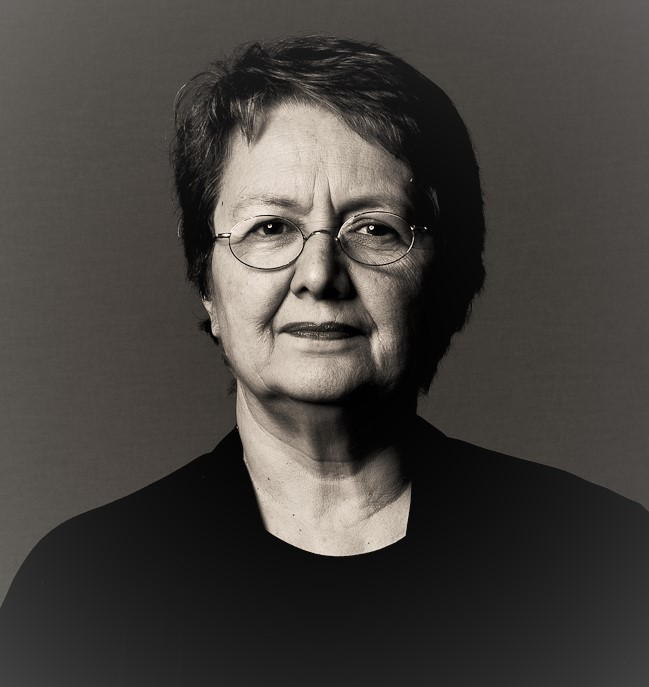

> ##### "Each life is an encyclopedia, a library, an inventory of objects, a catalog of styles, where everything can be constantly stirred up and reordered in every possible way"    Italo Calvino, *Lezioni Americane. Sei Proposte per il Prossimo Millennio*

* [Opening Statement](opening_statement.md)
* [Academic Profile](curriculum.md)
* [Publications](publications.md)
* [Interviews](interviews.md)
* [Conferences and Talks](onlinetalks.md)
* [Research / Projects](/research/projects.md)
* [Organization Scientific Meetings](organization_scientific_meetings.md)
* [Teaching / Doctoral Program FCTAS](teaching_doctoral_program.md)
* [Supervision](supervision.md)
* [Online Works and Projects](preprints.md)
* [Each Life](each_life.md) 
