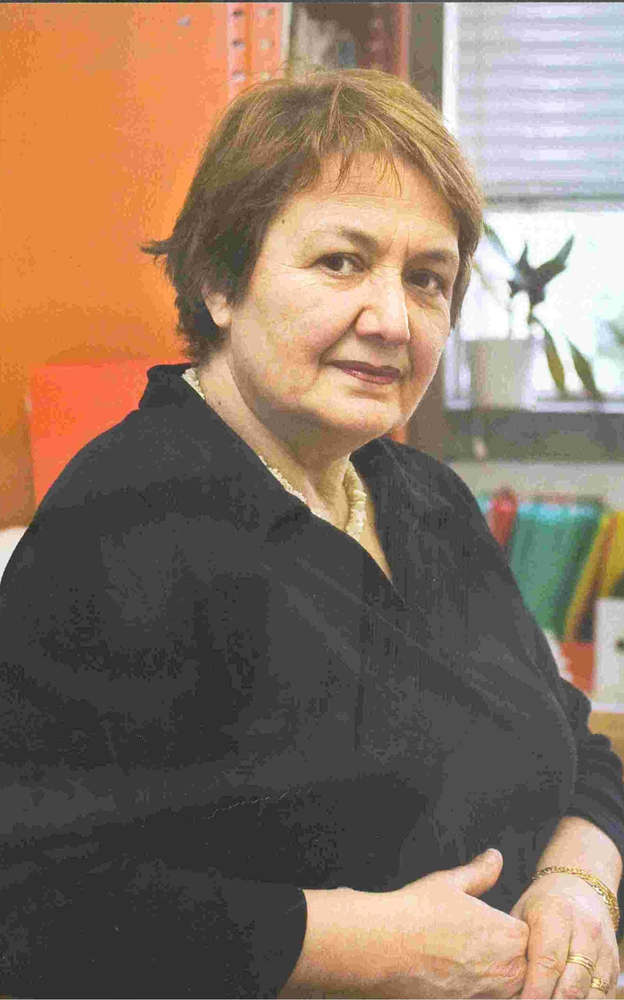

<h1 style="text-align: center; font-weight: 300; letter-spacing: 5px; margin-bottom: 40px; text-shadow: 2px 2px 4px #000;">Olga Pombo</h1>

    

        
    

    

    <blockquote style="font-style: italic; border-left: 4px solid #ff0; padding-left: 15px; margin: 0; font-size: 1rem; text-shadow: 1px 1px 2px #000;">
        "Each life is an encyclopedia, a library, an inventory of objects, a catalog of styles, where everything can be constantly stirred up and reordered in every possible way"
    </blockquote>
    

        <cite>Italo Calvino, *Lezioni Americane. Sei Proposte per il Prossimo Millennio*</cite>
    

    

    <a href="opening_statement.md">Opening statement</a>
    <a href="academic_profile.md">Academic profile</a>
    <a href="publications.md">Publications</a>
    <a href="onlinetalks.md">Talks</a>
    <a href="research.md">Research</a>
    <a href="supervision.md">Supervision</a>
    <a href="teaching_doctoral_program.md">Teaching</a>
    <a href="preprints.md">Preprints</a>
    <a href="interviews.md">Interviews</a>
    <a href="each_life/each_life.md">Each life...</a>

