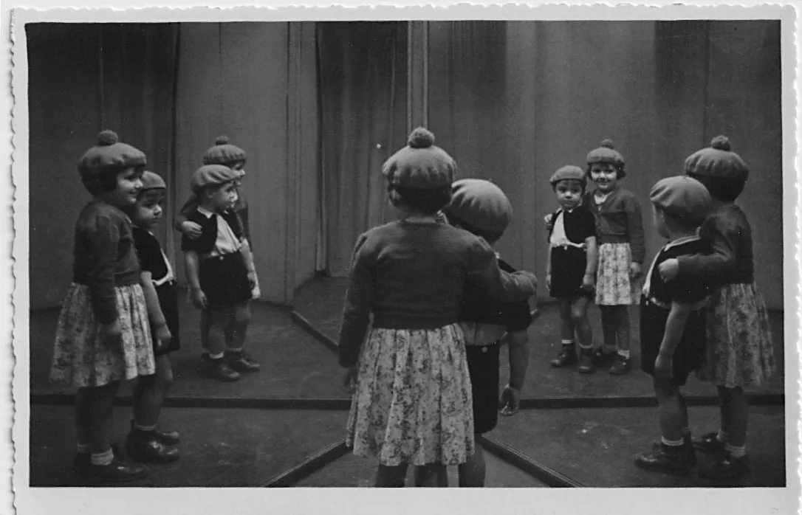

# Amigos

**Na infância, o meu único amigo era o meu irmão**. Brincávamos ao botão, ao berlinde. Andávamos de patins e trotinete no corredor que tinha 25 metros de comprido. Desenhavamos bichos e paisagens na mesa da casa de jantar. O Sergio também fazia plasticina. Eu lia e relia as mesmas historias, via e revia as mesmas imagens dos livros que, então, tinham poucas imagens. O jardim da Ninita. Uma edição para crianças do D. Quixote. Morávamos num terceiro andar sem elevador, numa rua movimentada, perto do parque Eduardo VII. Nunca saíamos senão com a minha mãe para ir ás compras, ao mercado ou à baixa. Ou com o meu avô que nos levava ao parque, ou, no verão, à estufa fria. Fomos uma vez ou outra à feira popular com o meu pai. E quando íamos, andávamos no carrossel e dávamos uma volta num dos barcos a pedal que existiam no lago que havia onde hoje é a Gulbenkian. Comíamos uma nuvem de açúcar e fazíamos, cada um, um furo na caixa dos chocolates. Não andávamos mas ficávamos a ver os carrinhos de choque e as motas no poço da morte. Uma vez entrámos na casa dos espelhos. 

  

  

 

**Depois, na escola primaria**. Recordo vultos mas não vejo as caras das minhas amigas. Sinto a turbulência da sala de aula. O cheiro abafado. A lousa, o giz, o caderno de duas linhas. O frasquinho do tinteiro. As manchas de tinta nos dedos. O barulho do intervalo que nunca tive. Eu era uma das meninas que não tinha intervalo porque tinha bata e sapatos. Só "as de pé descalço", como dizia a professora, iam ao intervalo. Eu ficava na sala de aula, presa e protegida de uma ameaça inexistente, a comer o lanche que a minha avó preparava: pão com manteiga e doce de tomate ou ovo cozido. Só no fim da aula, quando tocava a campainha, podia brincar. Não na sala do recreio, dentro da escola, mas no empedrado da entrada do antigo quartel de Junot. Brincava à cabra cega, ao elástico, à macaca. As minhas amigas eram sobretudo as tais meninas sem sapatos porque as outras, já obedientes, iam rapidamente para casa. Eu, pelo contrário, tinha autorização expressa do meu pai para ficar um pouco depois da aula, a brincar. Todas as meninas daquele escola tinham o destino traçado. Algumas iriam para o liceu, outras para a escola técnica. Eu fui para o liceu. As tais meninas não iam, nem para uma coisa, nem para a outra. Perdi o rasto a todas elas.
  
**Também tinha amigos na casa da minha tia**.  A minha tia vivia num rés do chão e, por isso, tinha um pequeno jardim onde havia uma roseira Stª Teresinha. Aí se reunia a criançada do prédio. Os amigos eram a menina do 1º andar de que não recordo o nome, e os irmãos Vasconcelos do 2º andar, o Afonso, a Manuela, e as suas outras irmãs. De vez em quando, íamos todos brincar para casa dos sete irmãos. Era um delírio pois o seu pai, psiquiatra que conhecia bem os efeitos civilizadores da repressão, permitia que os filhos fizessem tudo o que lhes apetecesse.  Mas, a maior parte das vezes, brincávamos no quintal da minha tia. Brincávamos, por exemplo,  a perder o comboio. Fazíamos um comboio com as cadeiras da sala de jantar e depois, cada uma de nós, carregadas de malas a fingir, corríamos para apanhar o comboio que, invariavelmente, já tinha partido, já ia a caminho, pouca terra, pouca terra. E nós ficávamos com as malas, caídos no cais a fingir exaustão. Uma vez, brincámos aos cabeleireiros. Lavámos as cabeças umas das outras,  com sabão azul e branco, em alguidares no chão que ia ficando cada vez mais escorregadio, o que permitiu transformar o cimento vermelho do quintal em ringue de patinagem.
  
**E tive muitos amigos na aldeia onde íamos passar as ferias grandes**. Amigos com quem brincávamos, eu e o meu irmão, de manha à noite: a Aida, a Preciosa e as filhas do Zé Pinto. Brincávamos a apanhar abelhas que guardávamos num copo de vidro. Tínhamos um baloiço no quintal. Uma cabra por baixo do nosso quarto. Galinhas, duas ou três ovelhas, uma vaca. Íamos com a Aida à fonte buscar agua, e com a Maria José ao pinhal apanhar palhuço para a estrumeira. Brincávamos na eira, escorregávamos na palha guardada na cabana e apanhávamos agrião na poça da Maria João.  Dávamos grandes passeios pelos pinhais, pelas leiras, pelos soutos de castanheiros. Apanhávamos nozes ainda verdes. Participávamos das debulhadas, das vindimas. O Sérgio fugia com os pastores. Andava a aldeia toda à procura do "menino Serginho". Depois do almoço, íamos ao correio. Era o grande acontecimento do dia. Quem ia buscar o correio à camioneta, era o louco da aldeia, o "Zé perdido". Recordo bem a sua figura elegante de príncipe: louro, de olhos azuis claríssimos, risonho, condescendente para com os aldeões que o olhavam com um misto de curiosidade e carinho. Era ele quem transportava às costas a saca de sarapilheira do correio, rua acima, até ao edifício onde o Sr. Mergulhão, que era meu padrinho, lhe dava sempre, a ele e a mim, um rebuçado. O Sr. Mergulhão lia então o correio. Presente. Esta doente, eu levo-lhe. No correio, onde também se vendiam tecidos, loiças, lâmpadas, café, sabão, sementes e outras coisas de uso, havia uma casinha de madeira onde estava o único telefone da aldeia. Ouvia-se tudo. 

Ao fim da tarde, íamos assistir à cerimonia sagrada de distribuição da água pelos terrenos cultivados, essa imagem que trago desde menina de um campo de trigo na hora da rega. À noite, íamos pela estrada silenciosa escutar o luar de agosto.

**Depois, as amigas do liceu**. Digo "amigas" porque, no Liceu Maria Amália de então, só entravam mulheres. Parece que havia um jardineiro mas, mesmo esse, estava proibido de se dar a ver às alunas. E os namorados que algumas alunas adolescentes se atreviam a ter, estavam proibidos de se aproximar do Liceu num raio de 250 metros. Tive a felicidade de ter uma amiga, a Ana Poiares, que me convidava com grande frequência a ir ao ballet e à ópera, no camarote de que a família tinha assinatura, em S. Carlos. À tarde, depois das aulas,  ouvíamos música: a abertura 1812, a nona sinfonia, Brahms. Das aulas propriamente ditas, recordo sobretudo as chamadas, as idas ao quadro, os risos incontidos.  Também algumas professoras: a de Inglês que tinha um grande sinal no meio da testa e era muito exigente com a pronunciação; e a de História com quem mantive diversas polémicas de *petite histoire*. Ainda a professora de Latim, cuja sobriedade e elegancia nunca deixei de admirar, e uma excelente professora de Literatura que lia Sá de Miranda com genuíno arrebatamento.

Em paralelo com o liceu, fazia ginástica no clube do bairro que, entretanto, se tinha instalado na minha antiga escola primária. O meu professor, Sergio Mendes, era um jovem talentoso e arrojado que queria transformar a ginastica em Portugal. Abandonar o estilo militar até aí preponderante e introduzir a "ginástica sueca". Foi então que entrei, pela primeira vez, na sala do recreio da minha antiga escola. Não propriamente para brincar, mas para ser feliz no exercício livre do corpo.

**Nos anos finais do liceu**, as minhas amizades multiplicaram-se em torno de dois grandes polos: a poesia e a politica.  A poesia, que aprendi a amar com a minha mãe -  cujos belíssimos sonetos eu sabia de cor - fez parte do meu corpo desde a infância. Ao serão, liamos e relíamos até as lágrimas os grandes sonetos da poesia portuguesa, sobretudo Camões, mas também Florbela Espanca. Adolescente, continuei a cultivar o amor à poesia com dois outros grandes poetas, o Zé Carlos Gancho - com quem lia obcessivamente Álvaro de Campos e Ricardo Reis - e o Fernando Couto que me ensinou a admirar Eugenio de Andrade, António Ramos Rosa, Jorge de Sena, Rui Belo, Miguel Torga, Herberto Helder, Sophia Mello Brayner. 

A consciência politica era elevada entre algumas colegas da minha turma. Eu e a Maria Emília Neves atirávamos papeis com mensagens politicas do alto das escadas centrais do liceu. Íamos às manifestações do primeiro de maio. Chegava sempre a casa pintada de azul e atrasada para o lanche que a minha mãe oferecia a toda a família no dia dos meus anos.  

Depois, não sei bem já como, o leque das nossas amizades alargou-se. De repente, éramos parte de uma **geração de jovens de esquerda em Lisboa**. Frequentávamos os mesmos sítios,  encontrávamo-nos nos cafés, nos jardins, nas cantinas universitárias, na "Casa dos Estudantes do Império", em reuniões de estudantes mais ou menos clandestinas. Também em festas particulares, como as em casa do Lucas, na Avenida da Republica, ou na magnifica esplanada sobre o Tejo da casa dos irmãos Marcelo e Marcela, no Alto de St. Amaro. Cantávamos juntos canções de protesto: a Internacional, *Le chant des partisans*. 

**Éramos todos da CPA** (comissão pró-associação dos estudantes do ensino secundário) e, alguns de nós, simpatizantes, ou mesmo membros, da juventude comunista. Na chamada crise de 61, não eramos ainda universitários, mas acompanhámos todas as lutas, assistimos aos plenários, às RIAS (reuniões inter-associações), participámos nas manifestações e greves de fome. 

A minha casa, na rua Marquês de Fronteira, chegou a ser um ponto central das amizades politicas minhas e do meu irmão: o Quim Zé Letria, o Chico Xaves, os irmãos Rosas, o Joel, a Lea e o Alfredo Nascimento.  A [Ana Rita](https://www.facebook.com/FascismoNuncaMais/posts/rita-gandra-n-1945militante-da-extrema-esquerda-cidad%C3%A3-antifascista-de-grande-di/3061207500655275/) só tinha licença dos pais para, à tarde, ir a minha casa. Foi lá que conheceu o Rui d'Épiney, seu companheiro na vida e na luta antifascista que ambos desenvolveram mais tarde com enorme coragem. 

A minha mãe desempenhava um papel central. Era ela que recebia os nossos amigos, os ajudava, os alimentava e escondia por vezes. Lembro-me de ela ter cozido o casaco de um amigo que se veio despedir porque, no dia seguinte, ia para a clandestinidade.  

....
....
....
....

**Não vou continuar esta narrativa**. 
Não interessa a ninguém senão a mim. muitos dos nomes que aqui poderia alinhar, já cá não estão. E, num momento que não sei identificar, nem já eu cá estarei para os recordar.

Ao pensar retrospectivamente na minha vida, sei que, cada etapa, ficou marcada por novos encontros, pessoas que nos foram mais ou menos próximas, amizades fortuitas e algumas profundas. 

<
<
<
<
<
<
<
<

Actualmente, **[a minha página de face book](https://www.facebook.com/olga.pombo.96), onde rarissimamente vou, assinala 734 amigos. Entretanto, não sei porquê (ou melhor, sei, uma vez que não percebo nada do facebook), tenho duas paginas de facebook e, na [segunda](https://www.facebook.com/olga.pombo.5), estão contabilizados 544 amigos. Ou seja, de acordo com o facebook, tenho 1278 amigos. 

Não me atrevo, de forma alguma, a acreditar estes números. Mas, confesso, sinto-me feliz por ter tido alguns grandes e bons amigos na minha vida. 

**Os amigos do dia 25**
