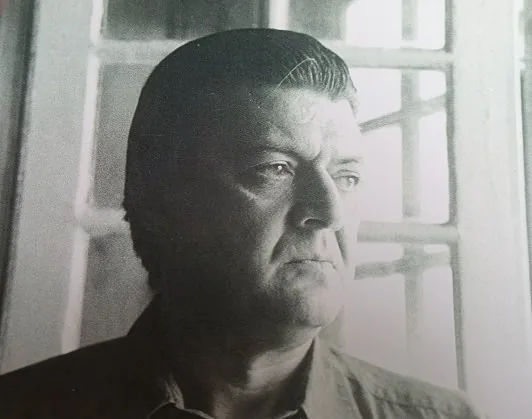
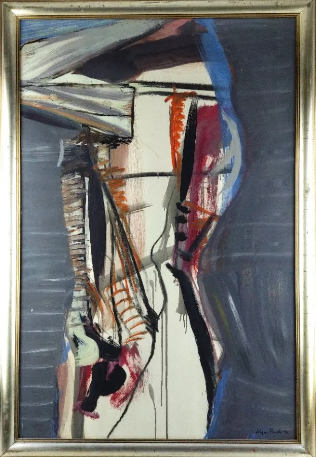
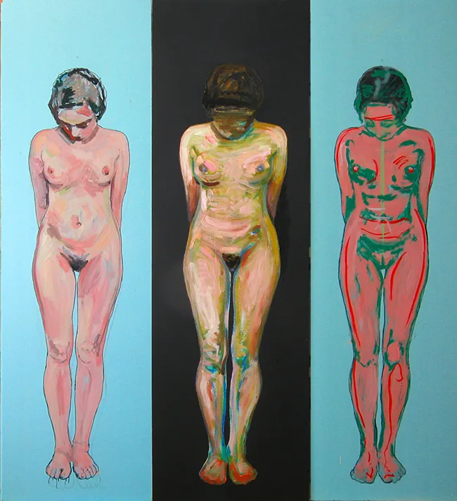
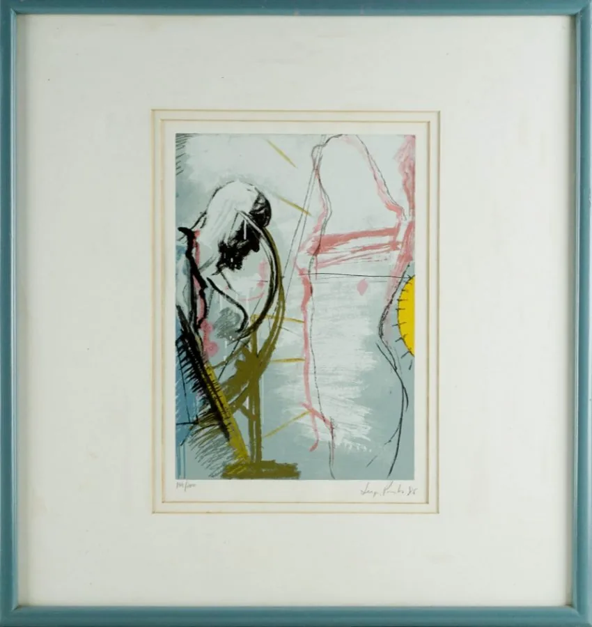
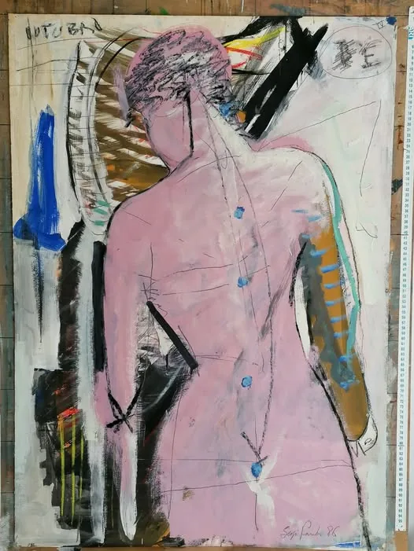
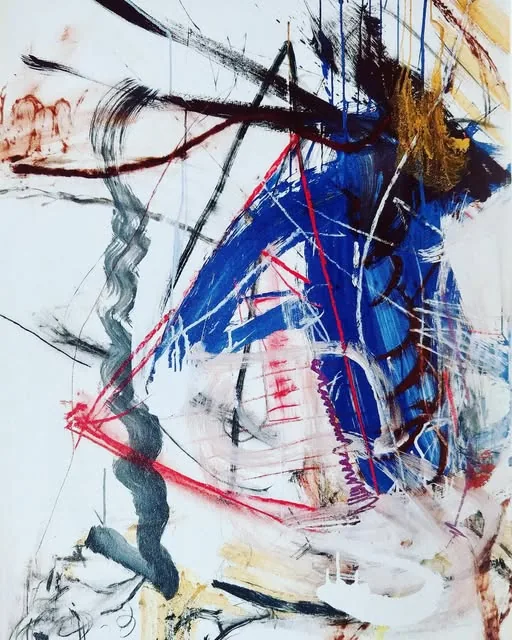
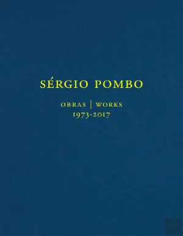
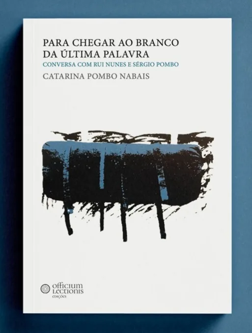
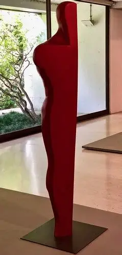
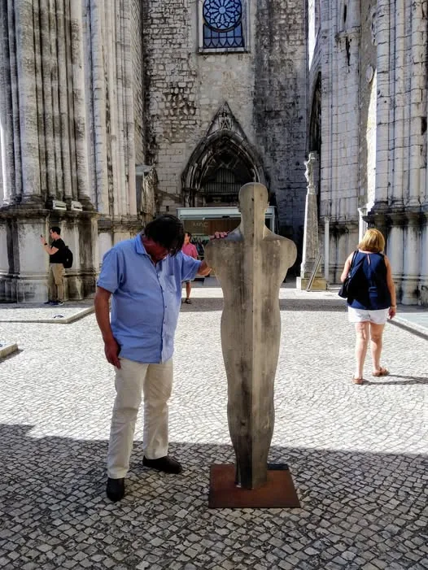

# Sergio Pombo, o meu irmão

O meu irmão era um Homem com letra grande: bom, forte, magnânimo e generoso. Havia nele uma grandeza sobre humana e uma humanidade calorosa. Para mim, ele era o meu irmão. [Companheiro absoluto, terno, incondicional](../../static/images/foto_eu_e-sergio_espelhos.webp). Deixou uma obra artística singularmente poderosa, vigorosa, livre e independente, em [pintura](../../static/images/pintura_sergio-pombo_aa9.webp), [escultura](../../static/images/esc_sergio_pombo_2.webp), [desenho](../../static/images/desenho_sergio_pombo_3.webp), [serigrafia](../../static/images/ser_sergio_pombo_5.webp), [gravura](../../static/images/gravura_sergio_pombo_espera.webp). 

###### My brother was a Man with capital letters: good, strong, magnanimous and generous.  For me,  he was my brother. The absolute companion, tender, unconditional. He left a singularly powerful, vigorous, free, independent artistic work in painting, sculpture, drawing, screen printing, engraving. 

  

>> *«Uma parte da minha pintura andou à volta da representação do corpo: do sangue, do sentimento, do prazer, do sabor, da força, do músculo, do tendão e do movimento, que é muito mais excitante, enervante e tenso, do que a representação de um cosmos – a representação geométrica»*, Sergio Pombo (aquando de uma exposição de escultura no Teatro da Politécnica, em Lisboa, em 2013)

>> ###### «A part of my painting has revolved around the representation of the body: blood, feeling, pleasure, taste, strength, muscle, tendon and movement — which is far more exciting, nerve‑wracking and tense than the representation of a cosmos, the geometric representation», Sérgio Pombo (on the occasion of an exhibition at Teatro da Politécnica, Lisbon, 2013).

  

>> ##### «A pintura de Sérgio Pombo — pintura, desenho, com figuras ou sem, a pintura que nele tudo é pintura, irredutivelmente pintura — é tão brilhantemente viva que ofusca, é tão desassombrada que nos assalta o equilíbrio, sofre, o dia em que nasci morra e pereça, dizia Job, amaldiçoa-nos — mas promete-nos o humano, o humano presente, o humano simplesmente, a vida de hoje, esta, sufocantemente bela na sua crueza rápida, na sua imensa solidão, Jorge Silva Melo.

>> ##### «Com a rapidez das estrelas cadentes no céu de todas as noites, Sérgio Pombo persegue a beleza, promete-nos que ela aí vem, está a chegar, voluptuosa, fulgurante, escandalosamente nova, de ontem à noite sempre, nua ainda», Jorge Silva Melo

  

_______________________________________________________________

## Sergio Pombo - Nota Biográfica

Sérgio Pombo nasceu em Lisboa, em 1947,  estudou pintura com Roberto Araújo e frequentou vários cursos na Gravura – Cooperativa de Gravadores Portugueses. Licenciado em Pintura pela Escola Superior de Belas Artes de Lisboa (1972). Foi bolseiro da Fundação Calouste Gulbenkian, em Portugal, entre 1976 e 1979, em 1984, e na Alemanha, entre 1992 e 1993, onde viveu e trabalhou de 1991 a 1993.

Entre as décadas de 1970 e 1980, fez parte do coletivo [**Grupo 5+1**](../../static/images/foto_grupo_512.webp "foto_grupo_512.webp"), que integrava igualmente os pintores [João Hogan](../../static/images/pintura_spombo_hogan.webp), Júlio Pereira, Guilherme Parente e Teresa Magalhães, assim como o escultor Virgílio Domingues (also [**here**](../../static/images/foto_grupo_511.webp "foto_grupo_511.webp")). 

Foi casado com a pintora [Teresa Magalhães](https://teresamagalhaes.com/), mãe do seu filho, o maestro [Marcos Magalhães Pombo](https://cesem.fcsh.unl.pt/pessoa/marcos-magalhaes/). Depois de um primeiro atelier em Santos o Velho, teve atelier nos Corucheus, em Lisboa, em Colónia, na Alemanha, e, posteriormente, na casa da Parede, onde reunia com frequência os seus muitos amigos e onde viveu os últimos anos da sua vida. 

## Registos video e audio

* Sérgio Pombo - Fundação D. Luis I [**Estatuas de Pintura**](https://www.youtube.com/watch?v=lnOg5u98dCk), 2018.
* Sérgio Pombo - Fundação Carmona e Costa [**Conversa com Sergio Pombo e convidados** (João Pinharanda, Jorge Silva e Melo, José Alexandre de S. Marcos](https://www.youtube.com/watch?v=lAZKjriBqZM), 2017.
* Sérgio Pombo - RTP1 - *Programa Moldura* [**Entrevista a Sergio Pombo com joaquim Letria**](https://arquivos.rtp.pt/conteudos/ja-esta-parte-ii-33) (from 33 on), 1988.
* Sérgio Pombo - RTP 1 [**Entrevista a Sergio Pombo**](https://arquivos.rtp.pt/conteudos/entrevista-a-sergio-pombo), 1979.
* Sérgio Pombo - Radio Observador - *O Elogio Público* [**Sergio Pombo sobre Guilherme Parente**](https://observador.pt/programas/cultura-do-elogio/o-elogio-publico-de-sergio-pombo)

  

  
  

## Exposições Individuais (selecção)
* 1973 – Lisboa, Galeria de 5. Francisco.
* 1975 - Lisboa, Galeria Gordilho.
* 1977 – Paris, Galeria Diagonale.
* 1978 – Lisboa, SNBA, Galeria de Arte Moderna.
* 1981 - Lisboa, Fundação Calouste Gulbenkian, **Exposição do Premio Nacional de Gravura**, [**Catálogo**].
* 1983 – Cascais, Galeria Diagonal, **Escultura/Pintura**
* 1984 – Lisboa, Galeria Quadrum.
* –––––– Lisboa, Galeria Cómicos. 
* 1985 - Palmela, Galeria Palmela.
* 1985 - Cascais, Galeria Alfarroba.
* 1986 – Lisboa, Altamira, [**Catálogo**].
* 1987 – Lisboa, Fundação Calouste Gulbenkian, [Premio Nacional de Gravura 1987](https://gulbenkian.pt/historia-das-exposicoes/exhibitions/568/). [**Catálogo**]
* –––––– Lisboa, Galeria Quadrum.
* 1988 – Lisboa, Loja de Desenho.
* 1988 – Lisboa, Galeria Vertice.
* 1990 – Lisboa, Galeria Alda Cortez, **Sérgio Pombo. Pintura**, [**Catálogo**].
* 1992 – Lisboa, Galeria Giefarte.
* 1994 – Lisboa, Galeria Giefarte.
* 1997 – Faro, Galeria Trem.
* 1999 – Funchal, Galeria Edicarte.
* 2000 – Lisboa, Galeria Reverso, **Escultura**.
* 2001 – Lisboa, CAM – Centro de Arte Moderna da Fundação Calouste Gulbenkian, [**Sergio Pombo. Pintura**](https://gulbenkian.pt/historia-das-exposicoes/exhibitions/1095), comissariada por Jorge Molder e João Pinharanda, ([**Catálogo**](https://gulbenkian.pt/cam/publications/sergio-pombo/))
* 2002 – Colares, Galeria de Colares, **O Voo da Cor no Branco da Memória**.
* 2005 - Lisboa, Teatro Taborda, [**A noite alemã e outros dias**](https://artistasunidos.pt/a-noite-alema-e-os-outros-dias-de-sergio-pombo). 
* 2007 – Lisboa, Galeria CiDiarte, **Pintura**.
* –––––– Lisboa, Galeria Valbom, **Sergio Pombo. Pintura 2002-2007** [**Catálogo**].
* –––––– Lisboa, Artistas Unidos, Convento das Mónicas, [**Sérgio Pombo. Desenho**](https://artistasunidos.pt/desenho-de-sergio-pombo).
* 2008 – Cascais, Galeria Vértice.
* –––––– Lisboa, Galeria Giefarte, **Sério Pombo. Pintura e Desenho**.
* –––––– Lisboa, Galeria CiDiarte, **Sério Pombo. Pintura**, [**Catálogo**].
* 2013 - Lisboa, Artistas Unidos, Teatro Politécnica, [**Sérgio Pombo. O Corpo e a Linha**](https://artistasunidos.pt/sergio-pombo-o-corpo-e-a-linha)
* 2013 - Lisboa, Museu Arqueológico do Carmo, [**Sérgio Pombo. O Corpo e a Memória. Escultura**](../../static/images/sergio-pombo_museu_carmo.webp "sergio-pombo_museu_carmo.webp")
* 2017 - Lisboa, Artistas Unidos, Teatro Politécnica.
* 2018 - Cascais, Centro Cultural de Cascais, [**Estatuas de Pintura**](https://www.youtube.com/watch?v=lnOg5u98dCk). ([slide show](https://www.facebook.com/photo/?fbid=10209290810337854&set=a.10209290802857667)), [**Catálogo**]
* 2018 - Lisboa, Artistas Unidos, Teatro Politécnica, [**Sergio Pombo Agora**](https://artistasunidos.pt/sergio-pombo-agora-2)
* 2020 - Lisboa, Fundação Carmona e Costa, **Sérgio Pombo: Obras 1973-2017**, comissariada por João Pinharanda. ([slide show 1](https://www.facebook.com/photo?fbid=2524951094240529&set=pcb.2524954544240184), [slide show 2](https://www.facebook.com/photo/?fbid=10209290810337854&set=a.10209290802857667)

## Exposições Internacionais (selecção)
* 1976 – Caracas, **Pintura Portuguesa**.
* 1977 – Viena, Áustria, **Exposição 5+1**.
* 1980 – França, **Festival Internacional de Pintura de Cagnes-sur-Mer**.
* 1982 – Paris, **XII Bienal de Paris** [**Catálogo**].
* 1984 – Cáceres, Espanha, **EIAM - I Exposição Ibérica de Arte Moderna**.
* 1985 – S. Paulo, Brasil, [**XVIII Bienal de S. Paulo**](https://gulbenkian.pt/historia-das-exposicoes/exhibitions/1250/).
* 1985 – Mérida, Espanha, **Pintado em Portugal**, [**Catálogo**]
* 1986 – Bruxelas, Bélgica, [**Le XXème au Portugal**](https://gulbenkian.pt/historia-das-exposicoes/exhibitions/477/).
* 1987 – Madrid, Espanha, [**Arte Contemporâneo Portugués**](https://gulbenkian.pt/historia-das-exposicoes/exhibitions/587/).
* 1987 – Brasília/Rio de Janeiro/São Paulo, Brasil, [**70-80 Arte Portuguesa**](https://gulbenkian.pt/historia-das-exposicoes/exhibitions/561/).
* 1987 – Madrid, Espanha, **ARCO – Feira Internacional**.
* 1987 – Moscovo, URSS, [**Pintura Portuguesa Contemporânea**](https://gulbenkian.pt/historia-das-exposicoes/exhibitions/603/).
* 1988 – Filadélfia, EUA, [**70-80. Arte Portuguesa**](https://gulbenkian.pt/historia-das-exposicoes/exhibitions/561/).
* 1988 – Atenas, Grécia, [**Portuguese Painting from the last 3 Decades**](https://gulbenkian.pt/historia-das-exposicoes/exhibitions/682/).
* 1992 – Strasburg, França, Palais de l'Europe, **Arte Portuguesa. Parlamento Europeu**.
* 2007 – Maputo, Moçambique, Galeria Moçambicana de Fotografia, **Sergio Pombo. Pintura**.

## Exposições Colectivas (selecção)
* 1965 – Lisboa, SNBA, **Salão de Outubro**.
* 1966 - Lisboa, Exposição dos Alunos da Gravura.
* 1966 - Lisboa, Estudantil de Artes Plásticas.
* 1967 – Lisboa, Exposição Conventos dos Marianos.
* 1972 – Lisboa, Exposição do Banco Português do Atlântico.
* 1972 - Lisboa, SNBA, **Exposição 72**
* 1973 – Famalicão, **Primeira Bienal dos Artistas Novos**.
* 1973 - Lisboa, SNBA, **Salão de Marco**. 
* 1974 – Lisboa, SNBA, **Salão 74**.
* –––––– Lisboa, **Painel Colectivo de 10 de Junho**.
* –––––– Luanda, **Salão Luanda**
* 1975 – Lisboa, SNBA, **Figuração Hoje**.
* –––––– Lisboa, Exposição de **100 Obras do Ministério da Comunicação Social**.
* –––––– Lisboa, Galeria Gordilho.
* 1976 – Lisboa, SNBA, **Grupo 5+1**.
* –––––– Lisboa, Fundação Calouste Gulbenkian, **20 anos de Gravura**.
* –––––– Lisboa, Secretaria de Estado da Cultura, **Gravura Portuguesa Contemporânea**.
* –––––– Lisboa, SNBA, **Arte Moderna Portuguesa**
* 1977 – Lisboa, SNBA, **Mitologias**.
* 1977 - Lisboa, SNBA, **Solidariedade e Apoio aos Prisioneiros Anti-fascistas Brasileiros**
* 1978 – Lisboa, SNBA, **Exposição 5+ 1**, [**Catálogo**].
* 1978 – Évora, Museu de Évora, **Exposição 5+ 1**, [**Catálogo**].
* 1979 – Porto, Cooperativa Árvore, **Exposição 5+ 1**.
* 1980 – Lisboa, Galeria de Arte Moderna, **Exposição Inventário 3**.
* 1980 – Lisboa, **Exposição CNARPE**
* 1980 – Lisboa, Palácio dos Corucheus, **Exposição Ateliers Municipais de Lisboa**
* 1980 – Lisboa, SNB, **Figurações. Intervenções**
* 1981 – Lisboa, Galeria de Exposições Temporárias, Fundação Calouste Gulbenkian, **IV Exposição Nacional de Gravura**.
* 1982 - Lagos, **Exposição Lagos 82**.
* 1983 – Lisboa, SNBA, **Depois do Modernismo** ([Catalogo, coordenado por Luis Serpa](https://www.livraria-ler-com-gosto.com/depois-do-modernismo)).
* –––––- Lisboa, SNBA, **Perspectivas Actuais da Arte Portuguesa**.
* –––––- Lisboa, Centro de Arte Moderna, Fundação Calouste Gulbenkian, **Alternativa 3**
* –––––- Almada, **Festival de Arte Viva**
* 1984 – Lisboa, **Primeira Exposição de Arte do Banco de Fomento Nacional**.
* –––––– Lisboa, Palácio de Queluz, **Exposição Incêndio**
* –––––– Lisboa / Porto, Instituto Alemão / Museu Soares dos Reis, **Onze Jovens Pintores Portugueses** [**Catálogo**].
* –––––– Porto / Lisboa, Museu Soares dos Reis / SNBA, **Exposição ARUS**.
* 1985 – Lisboa, CAM – Centro de Arte Moderna da Fundação Calouste Gulbenkian.
* –––––– Lisboa, Fundação Calouste Gulbenkian, **Imaginário da Cidade de Lisboa**.
* –––––– Lisboa, Ministério da Cultura, **Situações. Exposição Itinerante**.
* –––––– Lisboa, Galeria Quadrum, **Colectiva Quadrum**
* –––––– Lisboa, Galeria Quadrum, **Pequeno Formato**
* 1986 – Lisboa, CAM - Centro de Arte Moderna da Fundação Calouste Gulbenkian, [**III Exposição de Artes Plásticas**](https://gulbenkian.pt/dacosta/exhibitions/iii-exposicao-de-artes-plasticas/).
* –––––– Lisboa, Galeria Olharte, **Máscaras**
* –––––– Lisboa, Palácio dos Corucheus, **Artistas do Centro de Artes Plásticas dos Corucheus** [**Catálogo**]
* 1987 – Funchal, **Marca**
* –––––– Porto, Serralves, **Exposição Nacional de Arte Moderna**
* 1988 – Lisboa, FAC, **II Fórum de Arte Contemporânea** ([catalogo](https://www.instagram.com/p/DYojwePiLLA/?img_index=3)).
* –––––– Covilhã, **Pintura Portuguesa**
* 1991 – Lisboa, SNBA **Exposição de Artes Plásticas Portuguesas**.
* 1993 - Lisboa, **Prémio Banif de Pintura**.
* 1995 – Lisboa, FIL – **Feira de Arte**.
* 1997 – Lisboa, Galeria César.
* 2007 – Lisboa, Fundação Calouste Gulbenkian, [**50 Anos de Arte Portuguesa**](https://gulbenkian.pt/historia-das-exposicoes/exhibitions/93/).
* 2008 – Lisboa, Espaço Arte Contemporânea da Fundação Carmona e Costa, [**Aquilo sou Eu: Auto-retratos de Artistas Contemporâneos**](https://www.fundacaocarmona.org.pt/pt/espaco_arte_contemporanea/exposicoes_detalhe_00_1.aspx), obras da colecção Safira e Luís Serpa.
* 2011 – Lisboa, Pavilhão do Conhecimento Ciência Viva, **Corpo Imagem, representação do corpo na ciência e na arte**.
* 2019 - Setúbal, Galeria Municipal do 11, ["O Tempo Construído". Grupo 5+1 de 1976 a 2019](https://www.rostos.pt/inicio2.asp?cronica=9008000), [**Catálogo**], (press release [here](https://www.abrilabril.pt/cultura/51-uma-constelacao-nas-artes-visuais))
* 2019 - Amadora, Galeria Municipal Artur Bual - Casa Aprígio Gomes, **O Tempo Transformado. O Tempo e a Cidade, Grupo 5+1. De 1976 a 2019**, [**Catálogo**]
* 2021 - Guarda, Teatro Municipal da Guarda,**Sofia Areal em Diálogo com Sérgio Pombo**, ([video](https://www.facebook.com/reel/487604682453996))
* 2022 - Lisboa, MAAT (jardim), ["48 artistas, 48 anos"](https://www.maat.pt/pt/exhibition/48-artistas-48-anos-de-liberdade), curadoria de António Brito Guterres, Alexandre Farto, Carla Cardoso, João Pinharanda, ([video](https://www.facebook.com/100000663544891/videos/pcb.5518783471487050/371680814947254))
* 2026 - Lisboa, MAAT [**Turn Around. Um olhar sobre a coleção de Arte da Fundação EDP**](https://www.maat.pt/pt/event/conversa-com-rui-nunes-catarina-pombo-nabais-e-joao-pinharanda), curadoria de João Pinharanda.

## Colecções (selecção)
* CAM – Centro de Arte Moderna da Fundação Calouste Gulbenkian.
* Ministério da Cultura.
* Museu de Arte Contemporânea.
* Caixa Geral de Depósitos.
* Parlamento Europeu.
* Museu do Carmo.
* Colecções privadas.

## Prémios e representações oficiais
* 1980 - Representação Nacional no Festival de Pintura de Cagnes-sur-Mer
* 1981 – Prémio Nacional de Gravura.
* 1983 – Prémio de Gravura do Banco de Fomento Nacional.
* 1984 – Prémio de Aquisição de Lagos.
* 1984 - Representação Portuguesa à XVIII Bienal de S. Paulo.
* 1992 - Representação Nacional na XII Bienal de Paris.
* 1993 – Prémio Banif de Pintura.

  
## Bibliografia - Livros

**Sérgio Pombo**. Fotografias de [Maria José Palla](https://mariajosepalla.com/), volume fotocopiado com arranjo gráfico de Ana Horta e Maria José Palla e apoio técnico de Maria José Palma, Lisboa: 2002 

**Sergio Pombo. Pintura 1980-2007**. Texto de [Jorge Silva Melo](https://artistasunidos.pt/jorge-silva-melo/), Lisboa: Grifos, 2007, ISBN: 978-989-95400-0-2.

  

**[*Sérgio Pombo - Obras 1973-2017*](https://www.bertrand.pt/livro/sergio-pombo-obras-1973-2017-sergio-pombo/23679417), Lisboa: Documenta, 2018**, livro publicado por ocasião da exposição *Sérgio Pombo: Obras 1973-2017*, realizada na Fundação Carmona e Costa, com curadoria de João Pinharanda, entre 23 de Novembro de 2019 e 11 de Janeiro de 2020.

>>> ##### "No seu trabalho ecoam a potência masculina da vida (a vitalidade sujeita à morte) e a potência espiritual feminina (transportadora de vida)
>>> ##### «Sérgio Pombo exprime a sua subjectividade dominante e o seu «sentimento trágico da vida» através de uma figuração exacerbada; cria o seu próprio tempo e universo mas insere-os num tempo cronológico que os ultrapassa e num campo longo, expressionista (ainda não inteiramente revelado e estudado), da criação artística portuguesa. A sua obra está presa à angústia que os românticos e os modernos deixaram como herança à contemporaneidade: a vã procura do fio de Ariadne deitado ao chão por Teseu", **João Pinharanda** 

>>> ##### «Sérgio Pombo está para lá da contemplação, da interrogação, coloca-se sempre no lugar da acção. Não há comodismo, há uma intransigência quase autofágica que vive a inadaptação como elemento para evoluir. A sua pintura é ele, o seu corpo e os corpos que encontra, e pedaços de todos os lugares que se atravessam na vida humana, sempre à escala do ser humano vezes o infinito», *José Alexandre de São Marco*

  

 
**[*Para Chegar ao Branco da Última Palavra*](https://officiumlectionis.pt/produto/catarina-pombo-nabais-para-chegar-ao-branco-da-ultima-palavra/), Porto: Officium Lectionis, 2025**,
O livro nasce do encontro raro entre dois universos artísticos intensos e aparentemente opostos: a escrita de Rui Nunes e a pintura de Sérgio Pombo. A partir de uma conversa entre ambos, conduzida por Catarina Pombo Nabais, o livro explora as tensões e afinidades entre literatura e pintura, numa vontade de compreender os processos de experimentação artística destes dois monumentos da arte portuguesa.

>>> ##### "Muitíssimo para lá da representação, a obra de Sérgio Pombo coloca-nos perante linhas e formas que se misturam à velocidade do desejo criando um novo corpo, exuberante, total, sublime, que é a obra em si. E, aí, apercebemo-nos que já estamos para lá da pintura", *Catarina Pombo Nabais*

Sessão de [lançamento do livro "Para Chegar ao Branco da Última Palavra"](https://www.maat.pt/pt/event/conversa-com-rui-nunes-catarina-pombo-nabais-e-joao-pinharanda), conversa com Rui Nunes, Catarina Pombo Nabais e Joâo Pinharanda, Maat, Lisboa, 21 de maio 2026.
>> #### "Este lançamento foi também uma homenagem póstuma ao artista, celebrando a vitalidade da sua obra e a sua presença contínua na arte portuguesa".

## Catálogos e outros textos

* A.A.B.B.; Sérgio Pombo. **Catálogo da XII Bienal de Paris**. Ed. Ministère des Afaires Étrangers. Ministère de la Culture et Coordination Scientifique, Fondation Calouste Gulbenkian. Paris, 1982.
* Álvaro, Egídio; **Signes Énigmatiques et Obsédants de la Réalité Quotidienne**, in *Catálogo de Exposição Individual*. Ed. Galerie Diagonal, Paris, 1977.
* Alves de Oliveira, Manuel; **O Grande Livro dos Portugueses**. Ed. Círculo de Leitores, 1990.
* Cardoso, Luisa; **New York by Sergio Pombo at CAM**, in [CAM Gulbenkian](https://gulbenkian.pt/cam/en/sem-categoria/new-work-by-sergio-pombo-at-the-cam/) 
* Gonçalves, Rui Mário; **Sérgio Pombo**, in *Catálogo da XII Bienal de Paris*. 1982.
* Gonçalves, Rui Mário; in *Colóquio Artes*, nº 48.
* Gonçalves, Rui Mário; in *Jornal de Letras*, nº 79, pp. 10-16, 1984.
* Gonçalves, Rui Mário; in *Colóquio Artes*, nº 60, março 1984, pp.61-62
* Gonçalves, Rui Mário; **10 Anos de Artes Plásticas em Portugal, 1974-1984**. Ed. Caminho. Lisboa, 1985.
* Gonçalves, Rui Mário; in *Colóquio Artes*, nº 67, dezembro 1985.
* Gonçalves, Rui Mário; in *Colóquio Artes*, nº 103, dezembro 1994.
* Gonçalves, Rui Mário; **100 Pintores Portugueses do Século XX**; Ed. Alfa. Lisboa, 1996.
* Gonçalves, Rui Mário; **Vontade de Mudança. Cinco Décadas de Artes Plásticas**. Ed. Caminhi. Lisboa, 2004.
* Júdice, Nuno; **O Voo da Cor no Branco da Memória**, in *Catalogo da exposição A noite alemã e outros dias*, Artistas Unidos, Lisboa, 2005 
* Melo, Alexandre; **Sérgio Pombo. Estudos para um Retrato (entrevista)**, in *Jornal de Letras*, nº 128, pp. 18-24, dezembro 1984.
* Melo, Alexandre; **Nove Artistas, 1987/1997**, in *Catálogo de Exposição*. Ed. César Galeria. Lisboa, 1997.
* Melo, Jorge Silva e; **Com a Rapidez das Estrelas Cadentes, Fulgurantes**, in *Sérgio Pombo, Pintura, 1980-2007*, pp. 5-11. Lisboa, 2007.
* Melo, Jorge Silva e; **A Pintura de Sérgio Pombo**, in *Catálogo de Exposição Sérgio Pombo. O Corpo e a Linha*, Artistas Unidos, Lisboa, 2013.
* Melo, Jorge Silva e; **Sergio Pombo Agora**, in *Catálogo de Exposição Sérgio Pombo Agora*, Artistas Unidos, Lisboa, 2018
* Molder, Jorge; **Sérgio Pombo**, in *Catálogo de Exposição*. Ed. Fundação Calouste Gulbenkian. Lisboa, 2001.
* Nabais, Nuno; **Sérgio Pombo. O Fascínio pelo Retrato**, in *Jornal de Letras*, nº 80, pp. 17-23, janeiro 1984.
* Correa, Carlos Natividade, *Grande Reportagem*, 14 de dezembro 1984.
* Pinharanda, João; **Alguns Corpos. Imagens da Arte Portuguesa entre 1950 e 1990**. Ed. EDP. Lisboa, 1998.
* Pinharanda, João; **Ulisses no Lugar de Penélope**, in *Sérgio Pombo. Catálogo de Exposição*. Ed. Fundação Calouste Gulbenkian. Lisboa, 2001.
* Pinharanda, João; **A Medida de Todas as Coisas**, in *Catálogo de Exposição Sérgio Pombo. O Corpo e a Linha*, Artiastas Unidos, Lisboa, 2013
* Porfírio, José Luís; in *Revista Expresso*, 15 de dezembro 1984.
* Rato, Vanessa; **Escultura como Pintura como Escultura**, in *Público. Ipsilon*, 13 de março 2013.
* Rocha de Sousa, **Toda a Cidade é um Museu Encoberto**, in *Pintura Portuguesa Contemporânea nas Colecções Particulares de Coimbra*. Ed. Câmara Municipal de Coimbra, Coimbra, 2003.
* Pombo Nabais, Catarina, **Para Chegar ao Branco da Última Palavra. Conversa com Sergio Pombo e Rui Numes**, Porto: Officium Lectionis, 2025

## Outra informação

* Sérgio Pombo – [Artistas Unidos](https://artistasunidos.pt/sergio-pombo)
* Sérgio Pombo  – [Centro de Arte Moderna - Gulbenkian](https://gulbenkian.pt/cam/noticias/sergio-pombo-1947-2022)
* Sérgio Pombo  – [Centro de Arte Moderna - Gulbenkian](https://gulbenkian.pt/cam/artist/srgio-pombo)
* Sérgio Pombo  – [Centro de Arte Moderna - Gulbenkian](https://gulbenkian.pt/cam/en/read-watch-listen/new-work-by-sergio-pombo-at-the-cam)
* Sérgio Pombo  – [Centro de Arte Moderna - Gulbenkian](https://gulbenkian.pt/cam/works/s-titulo-figura-feminina-na-praia-154854)
* Sérgio Pombo – [Centro Nacional de Cultura](https://www.cnc.pt/sergio-pombo-1947-2022)
* Sérgio Pombo - [Jornal Publico](https://www.publico.pt/2022/07/12/culturaipsilon/noticia/morreu-artista-plastico-sergio-pombo-autor-pintura-tao-brilhantemente-viva-ofusca-2013367)
* Sérgio Pombo – [Jornal Observador](https://observador.pt/2022/07/12/morreu-o-artista-plastico-sergio-pombo-o-pintor-da-representacao-do-corpo)
* Sérgio Pombo - [Agenda Cultural de Lisboa](https://www.agendalx.pt/events/event/sergio-pombo)
* Sérgio Pombo – [Fundação PLMJ](https://www.fundacaoplmj.com/pt/colecao/artistas/sergio-pombo/997)
* Sérgio Pombo - [Parlamento €uropeu](https://art-collection.europarl.europa.eu/pt/artists/sergio-pombo)
* Sérgio Pombo - [Parlamento €uropeu](https://art-collection.europarl.europa.eu/pt/collections/sem-titulo-6)
* Sérgio Pombo - [Fundação Elídio Pinho](https://arte.fundacaoip.pt/artist/197)
* Sérgio Pombo - [Gulbenkian Descobrir. Museu Gulbenkian. Cada Corpo é um Universo. Sobre o *Homem Vermelho* de Sérgio Pombo]( https://cdn.gulbenkian.pt/wp-content/uploads/2023/09/Um_Museu_em_Movimento_22_23.pdf).
* Sérgio Pombo – [Wikipédia](https://pt.wikipedia.org/wiki/S%C3%A9rgio_Pombo)
* Sérgio Pombo - [Facebook](https://www.facebook.com/profile.php?id=100009665319498)
* Sérgio Pombo - [Artnet](https://www.artnet.com/artists/s%C3%A9rgio-pombo)
* Sérgio Pombo - [MutualArt](https://www.mutualart.com/Artist/Sergio-Pombo/B7B012F83DAA7EFC)
* Sérgio Pombo - AskArt
* Sérgio Pombo - Artprice
* Sérgio Pombo - [Veritas Art](https://veritas.art/lot/sergio-pombo-interior-do-ateliertecnica-mista-sobre-tela)
* Sérgio Pombo - [Cabral Moncada](https://www.cml.pt/leiloes/2017/190-leilao/1-sessao/272/sem-titulo)

  
  

