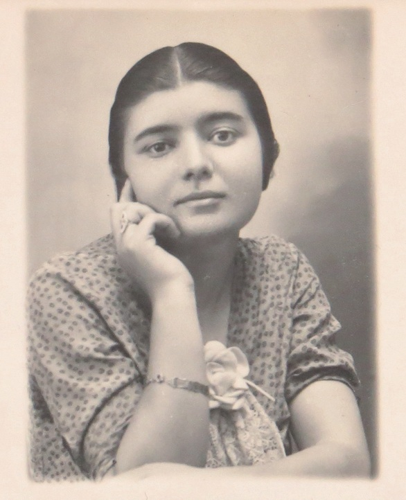
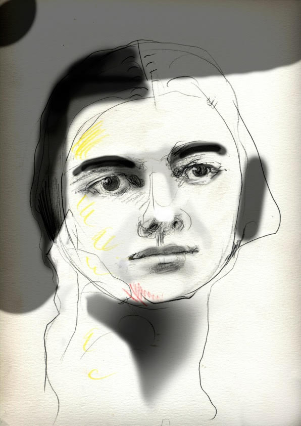

# A minha mãe

    
    < fotografia de Maria do Rosario Pombo (1916-2006)
    

> Maria do Rosário Pombo, **Dentro de mim so há Marão**, Lisboa, 2016.
>
> A capa foi construída a partir de um desenho magnifico de Sergio Pombo, seu filho, tomando como base uma fotografia antiga. O livro foi editado por Catarina Pombo Nabais, sua neta, em 2016. Nele se reúne tudo o que foi possivel resgatar da escrita da minha mãe: poemas manuscritos, versos dispersos publicados em jornais da época, textos de intervenção, algumas cartas, fotografias, fac-símiles e outros fragmentos que sobreviveram ao tempo e ao esquecimento. Inclui ainda testemunhos das suas duas netas e do seu neto - Patricia Pombo Medeiros, Catarina Pombo Nabais e Marcos Magalhães Pombo.

> [**Dentro de mim so há Marão**](../../static/pdf-text/MRP_livro_dentro_de_mim.pdf) é o livro de poesia que a minha mãe nunca publicou. Fomos nós, seus filhos e netos que, cem anos após o seu nascimento, quisemos reunir os poemas que restaram da devastação a que a sua poesia foi sujeita, e publicámos, em edição de autor, um livro com os poemas que conseguimos salvar. O acontecimento - inaudito, inconcebivel, inqualificavel - que está na origem da destruição da maior parte da obra poética da minha mae, e que explica esta edição póstuma, está narrado no interior do livro, entre as páginas 29 e 30. Este livro é, por isso, um gesto que procura interromper o desaparecimento a que a poesia da minha mãe foi condenada. 

> **Cartas à tia Adeliza** - um episódio indelével que revela quem era a minha mãe.

> > ***"Diz-se que o luto, com o seu trabalho progressivo, apaga lentamente a dor. Eu não podia nem posso acreditar nisso, porque, para mim, o Tempo elimina a emoção da perda (não choro), é tudo. Quanto ao resto, tudo permaneceu imóvel. Porque aquilo que eu perdi não é uma Figura (a Mãe), mas um ser; e não um ser, mas uma qualidade (uma alma): não a indispensável, mas a insubstituível. Eu podia viver sem a Mãe (todos nós podemos, mais cedo ou mais tarde); mas a vida que me restava seria infalivelmente e até ao fim inqualificável (sem qualidade)."***  Roland Barthes, *A Câmara Clara*
