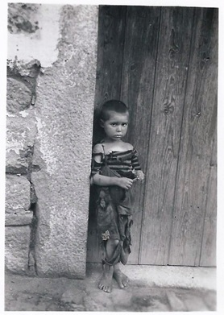
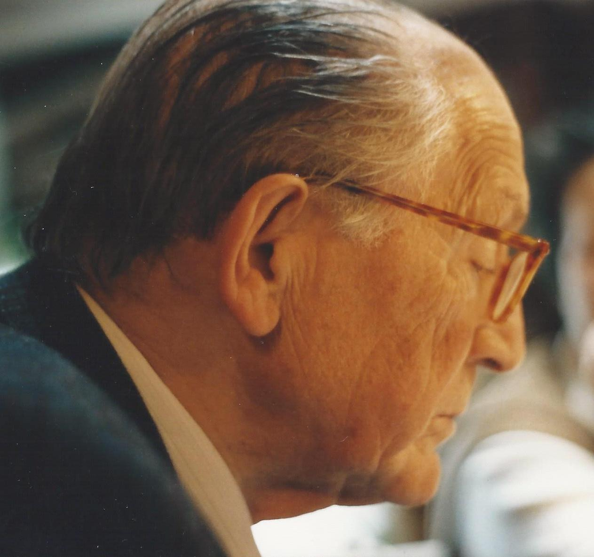
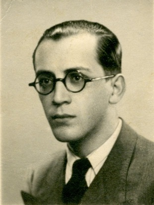
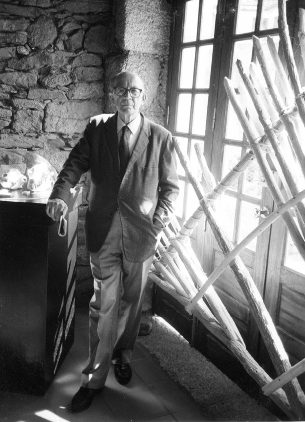

## Yes, each life is an encyclopedia 

Beeing done, beeing done, beeing done, beeing done, beeing done....

**First similitude between life and encyclopaedia:**
This page is very incomplete, for the moment. Will it ever be complete ?

_________________________

**O meu pai** gostava muito de fotografia. Com a sua máquina kodak a tiracolo, ele tirava magnificas fotografias familiares, cristais de memória da minha infancia, festas de anos, passeios, encontros, acontecimentos da vida familiar.  Mas tambem virava a objetiva para fora, para longe, para o mundo distante do nosso circulo de giz caucasiano: mundo em cujo destino ele estava profundamente empenhado. Esta fotografia foi tirada em 1952, em S. Cosmado, a aldeia do Alto Douro em que a minha mãe nasceu e onde íamos, todos os anos, passar as férias que, naquele tempo, eram grandes. 

###### **My father loved photography. With his Kodak camera always at his side, he captured beautiful family moments — crystalline fragments of my childhood, birthday parties, walks, gatherings, the small events that made up our family life. But he also turned his lens outward, toward the wider world, far beyond the narrow circle of our everyday life — a world whose fate mattered to him deeply. This photograph was taken in 1952, in S. Cosmado, the village in the Alto Douro where my mother was born and where we spent our long summer holidays every year.**

É a fotografia de um menino, como havia muitos na aldeia. Descalço, vestido de trapos, ele era bem a expressao do nosso país nos anos 50. Da miséria, da pobreza, do abandono. O que deslumbra é a força serena mas interrogativa com que o menino nos olha de frente. 

###### **It is the photograph of a boy, one of many in the village. Barefoot, dressed in rags, he embodied the Portugal of the 1950s — a country marked by poverty, hardship, and neglect. What astonishes is the calm yet questioning strength with which he looks straight at us**.

Mas, a grande paixao do meu pai eram os livros. Tinha-os por todo o lado.  No escritorio, na sala, nos corredores, na casa de jantar, atras das portas, nos quartos, na marquise, na dispensa, em prateleiras até ao tecto, em tudo o que era armário, ou secretária, ou mesinha de cabeceira. Um admirável estudioso, um erudito dominado por uma curiosidade comovente. Ele era também um bibliófilo que amava os livros na sua materialidade. O seu cheiro, o seu peso, a sua espessura. 

###### **But my father’s greatest passion was books. They were everywhere: in his study, in the living room, in the corridors, in the dining room, behind doors, in bedrooms, on the enclosed balcony, even in the pantry. Shelves reaching the ceiling, every cupboard, desk, and bedside table overflowing. A remarkable scholar, an erudite driven by a moving curiosity. He was also a bibliophile who loved books in their material presence — their smell, their weight, their thickness**.

Na despedida, não pude ficar com todos os seus livros. Eu tambem tinha os meus e a minha casa não era sufucientemente grande para juntar os dele aos meus. Guardei apenas umas centenas de exemplares sobre as varias zonas de interesse de que era constituída a sua biblioteca: muita Filosofia, muita mas muita História, Politica, Religiões, Antropologia, Economia, Sociologia, Linguística.   

Além de uma biblioteca de mais de 10.000 livros, o  meu pai deixou também um livro que nunca chegou a escrever. Milhares de fichas, anotações, apontamentos que coleccionava por temas, rascunhos, notas, recortes de jornais e revistas, postais, prospectos que selecionava segundo critérios muito estritos, em função de um livro que planeava escrever, que poderia ter escrito, que nunca acabou de escrever. No entanto, como eu vim a compreender mais tarde, na sua forma estranha, guardados em pastas e caixas de sapatos, esses milhares de documentos de todo o tipo que o meu pai colecionou ao longo da sua vida (os seus "papeis"), configuram o livro que ele nao escreveu. Um projecto intenso, a que dedicou muito da sua vida. Livro que, embora não se possa ler no normal formato *in folio*, como conjunto de páginas ligadas sequencialmente umas às outras, de acordo com uma numeração contínua, não deixa de ser uma viagem com um resultado palpavel, material, legivel, verdadeiro.

###### **When the time came to say goodbye, I could not keep all his books. I had my own, and my house was not large enough to hold his library alongside mine. I kept only a few hundred volumes, chosen from the many areas that shaped his intellectual world: Philosophy, and an extraordinary amount of History, as well as Politics, Religions, Anthropology, Economics, Sociology, Linguistics**.

###### **Beyond a library of more than 10,000 books, my father also left behind a book he never wrote. Thousands of index cards, notes, drafts, clippings, postcards, brochures — all carefully collected and organised by theme, selected according to strict criteria, all pointing toward a book he planned to write, could have written, but never completed. Yet, as I came to understand later, in their strange form — stored in folders and shoeboxes — those thousands of documents he gathered throughout his life (his “papers”) are the book he did not write. An intense project to which he devoted much of his life. A book that cannot be read in the usual in folio format, as a sequence of numbered pages, but which remains a journey with a tangible, material, legible, and true result.**

Tive "os papeis" do meu pai guardados em caixotes em minha casa. Nao sabia o que lhes havia de fazer. Acabei por os entregar ao Pacheco Pereira que, amavelmente, os recebeu e guardou no "Arquivo Ephemera", essa instituição tão prodigiosa, por si tão bem criada e coordenado. Nessa altura, e a seu
pedido, redigi uma brevissima nota biográfica do meu pai para sinalizar a entrada dos seus "papeis" no [*Arquivo Ephemera*](https://ephemerajpp.com/).

###### **I kept my father’s “papers” stored in boxes at home. For a long time, I did not know what to do with them. Eventually, I entrusted them to Pacheco Pereira, who kindly received them and preserved them in the Arquivo Ephemera, that remarkable institution he created and directs with such care. At that time, at his request, I wrote a very brief biographical note about my father to accompany the arrival of his “papers” at the [*Arquivo Ephemera*](https://ephemerajpp.com/).**

###### *João Pires Martins. Nasceu em Lisboa, 5 de Dezembro de 1912. Licenciou-se em Histórico-filosóficas pela Faculdade de Letras da Universidade de Lisboa. Nunca aceitou assinar a declaração que era exigida pelo regime de Salazar aos funcionários públicos pelo que foi, toda a sua vida, professor do ensino particular. Foi muito estimado e admirado pelos seus alunos para quem constituiu referencia intelectual e moral. Viveu modestamente, cultivando uma única paixão: os livros. Comprou muitos livros, leu vorazmente muitos livros, coleccionou muitos livros. Falava constantemente de livros que tinha lido ou comprado ou simplesmente admirado na montra de uma livraria. Era um erudito, estudioso até ao fim da sua vida. Profundo conhecedor de Religiões Comparadas e de Historia Universal, sobretudo de Portugal e da França, país que ele amava com devoção. Como muitos da sua idade, viveu integralmente a ditadura salazarista. Nunca pertenceu a nenhum partido politico, mas era extremamente atento a tudo o que se passava em Portugal e no Mundo. O 25 de Abril constituiu, para ele, o acontecimento politico mais feliz da sua vida. Faleceu no dia 23 de Junho de 2005. [*Ephemera. Noticias da Semana* de 4 a 10 de dezembro de 2017. "Pastas entradas no Arquivo"](https://ephemerajpp.com/2017/12/07/ephemera-noticias-da-semana-de-4-a-10-de-dezembro-de-2017/)*.

###### *João Pires Martins. He was born in Lisbon on 5 December 1912. He graduated in Historical‑Philosophical Studies from the Faculty of Arts of the University of Lisbon. He never agreed to sign the declaration required by Salazar’s regime for public servants, and for that reason he spent his entire life teaching in private schools. He was deeply respected and admired by his students, for whom he became an intellectual and moral reference. He lived modestly, cultivating a single passion: books. He bought many books, read voraciously, collected endlessly. He spoke constantly about books he had read or purchased, or simply admired in a bookshop window. He was a scholar to the very end of his life — an erudite man with a profound knowledge of Comparative Religions and World History, especially the histories of Portugal and France, a country he loved with devotion. Like many of his generation, he lived fully under the Salazar dictatorship. He never belonged to any political party, but he followed closely everything that happened in Portugal and in the world. The 25th of April was, for him, the happiest political event of his life. He passed away on 23 June 2005. [*Ephemera. Noticias da Semana* de 4 a 10 de dezembro de 2017. "Pastas entradas no Arquivo"] see [Ephemera. News of the Week, 4–10 December 2017, “Folders entering the Archive”](https://ephemerajpp.com/2017/12/07/ephemera-noticias-da-semana-de-4-a-10-de-dezembro-de-2017/).*

Resta dizer que todos os dias converso com ele. Que ele permanece presente ao meu lado, na forma como penso, como trabalho. Como olho o mundo.

###### It remains to be said that I speak with him every day. He stays beside me, present in the way I think, in the way I work. In the way I look at the world.

