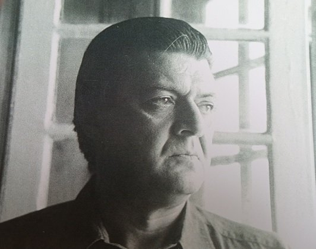
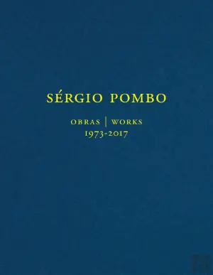
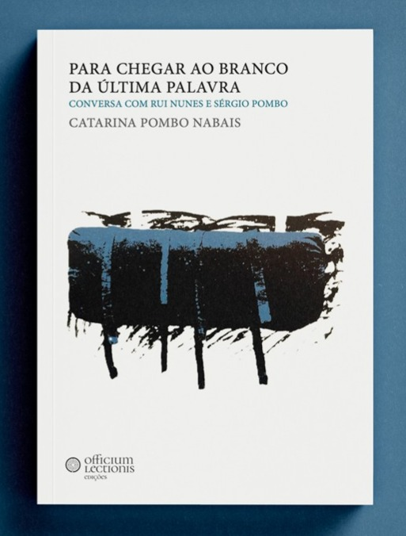
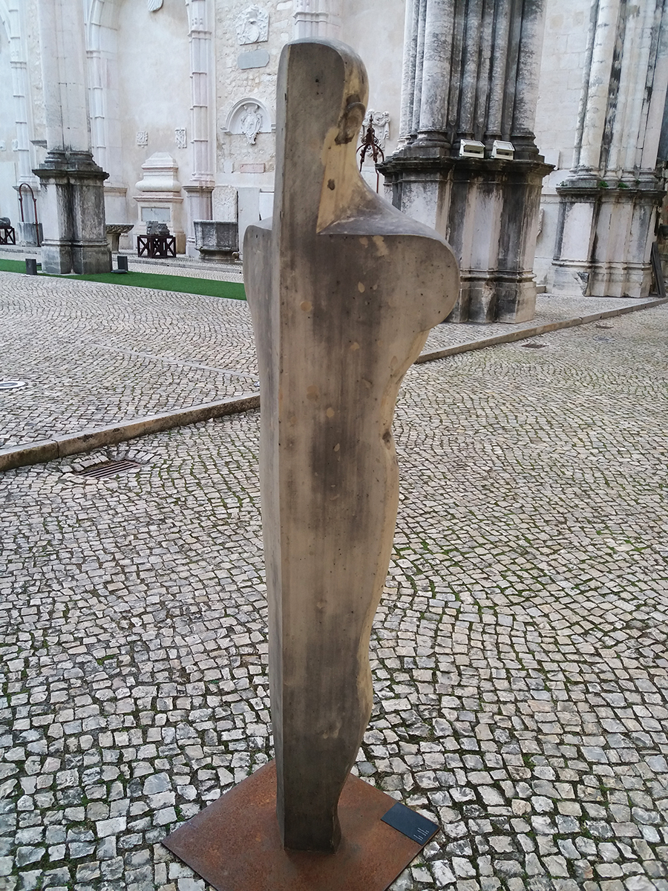

# O meu irmao

O meu irmão era um Homem com letra grande: bom, forte, magnanimo e generoso. Havia nele uma grandeza sobre humana e uma humanidade calorosa. Para mim, ele era o meu irmao. O companheiro absoluto, terno, incondicional.
Deixou uma obra artistica singularmente poderosa, vigorosa, livre e independente, em pintura, escultura, desenho, serigrafia, gravura. 

###### My brother was a Man with capital letters: a good, strong, magnanimous and generous person.  For me,  he was my brother, the absolute companion, tender, unconditional. He left a singularly powerful, vigorous, free, independent artistic work in painting, sculpture, drawing, screen printing, and engraving.

[Sérgio Pombo - Obras 1973-2017, Lisboa: Documenta, 2018](https://www.bertrand.pt/livro/sergio-pombo-obras-1973-2017-sergio-pombo/23679417). Livro publicado por ocasião da exposição *Sérgio Pombo: Obras 1973-2017*, com curadoria de João Pinharanda, realizada na Fundação Carmona e Costa, entre 23 de Novembro de 2019 e 11 de Janeiro de 2020.

> «No seu trabalho ecoam a potência masculina da vida (a vitalidade sujeita à morte) e a potência espiritual feminina (transportadora de vida)
> «Sérgio Pombo exprime a sua subjectividade dominante e o seu «sentimento trágico da vida» através de uma figuração exacerbada; cria o seu próprio tempo e universo mas insere-os num tempo cronológico que os ultrapassa e num campo longo, expressionista (ainda não inteiramente revelado e estudado), da criação artística portuguesa. A sua obra está presa à angústia que os românticos e os modernos deixaram como herança à contemporaneidade: a vã procura do fio de Ariadne deitado ao chão por Teseu", **João Pinharanda** 

> **«A pintura de Sérgio Pombo — pintura, desenho, com figuras ou sem, a pintura que nele tudo é pintura, irredutivelmente pintura — é tão brilhantemente viva que ofusca, é tão desassombrada que nos assalta o equilíbrio, sofre, o dia em que nasci morra e pereça, dizia Job, amaldiçoa-nos — mas promete-nos o humano, o humano presente, o humano simplesmente, a vida de hoje, esta, sufocantemente bela na sua crueza rápida, na sua imensa solidão.
> «Porque Sérgio Pombo, com a rapidez das estrelas cadentes no céu de todas as noites, persegue a beleza, promete-nos que ela aí vem, está a chegar, voluptuosa, fulgurante, escandalosamente nova, de ontem à noite sempre, nua ainda»**, **Jorge Silva Melo**

> «Sérgio Pombo está para lá da contemplação, da interrogação, coloca-se sempre no lugar da acção. Não há comodismo, há uma intransigência quase autofágica que vive a inadaptação como elemento para evoluir. A sua pintura é ele, o seu corpo e os corpos que encontra, e pedaços de todos os lugares que se atravessam na vida humana, sempre à escala do ser humano vezes o infinito.», **José Alexandre de São Marco**

> > **"Uma parte da minha pintura andou à volta da representação do corpo: do sangue, do sentimento, do prazer, do sabor, da força, do músculo, do tendão e do movimento”, que é “muito mais excitante, enervante e tenso, do que a representação de um cosmos – a representação geométrica”**, **Sergio Pombo** (aquando de uma exposição de escultura no Teatro da Politécnica, em Lisboa, em 2013).

> 
> **Para Chegar ao Branco da Última Palavra, Porto: Officium Lectionis, 2025**,
> O livro nasce do encontro raro entre dois universos artísticos intensos e aparentemente opostos: a escrita de Rui Nunes e a pintura de Sérgio Pombo. A partir de uma conversa entre ambos, conduzida por Catarina Pombo Nabais, o livro explora as tensões e afinidades entre literatura e pintura, numa vontade de compreender os processos de experimentação artística destes dois monumentos da arte portuguesa.

## Registos video e audio
* Sérgio Pombo - Fundação D. Luis I [**Estatuas de Pintura**](https://www.youtube.com/watch?v=lnOg5u98dCk), 2018.
* Sérgio Pombo - Fundação Carmona e Costa [**Conversa com Sergio Pombo e convidados** (João Pinharanda, Jorge Silva e Melo, José Alexandre de S. Marcos](https://www.youtube.com/watch?v=lAZKjriBqZM), 2017.
* Sérgio Pombo - RTP1 - *Programa Moldura* [**Entrevista a Sergio Pombo com joaquim Letria**](https://arquivos.rtp.pt/conteudos/ja-esta-parte-ii-33) (from 33 on), 1988.
* Sérgio Pombo - RTP 1 [**Entrevista a Sergio Pombo**](https://arquivos.rtp.pt/conteudos/entrevista-a-sergio-pombo), 1979.
* Sérgio Pombo - Radio Observador - *O Elogio Público* [**Sergio Pombo sobre Guilherme Parente**](https://observador.pt/programas/cultura-do-elogio/o-elogio-publico-de-sergio-pombo)

_______________________________________________________________

## Sergio Pombo - Nota Biobibliográfica

Sérgio Pombo nasceu em Lisboa, em 1947,  estudou pintura com Roberto Araújo e frequentou vários cursos na Gravura – Sociedade Cooperativa de Gravadores Portugueses. Licenciado em Pintura pela Escola Superior de Belas Artes de Lisboa (1972). Foi bolseiro da Fundação Calouste Gulbenkian, em Portugal, entre 1976 e 1979, e na Alemanha, entre 1992 e 1993, onde viveu e trabalhou de 1991 a 1993.

Entre as décadas de 1970 e 1980, fez parte do coletivo [**Grupo 5+1**](images/foto_grupo_512.jpg "foto_grupo_512.jpg"), que integrava igualmente os pintores João Hogan, Júlio Pereira, Guilherme Parente e Teresa Magalhães, assim como o escultor Virgílio Domingues (also [**here**](images/foto_grupo_511.jpg "foto_grupo_511.jpg")).

## Exposições Individuais (selecção)
* 1973 – Lisboa, Galeria de 5. Francisco.
* 1977 – Paris, Galeria Diagonale.
* 1978 – Lisboa, SNBA, Galeria de Arte Moderna.
* 1983 – Cascais, Galeria Diagonal, **Escultura/Pintura**
* 1984 – Lisboa, Galeria Cómicos.
* –––––– Lisboa, Galeria Quadrum.
* 1986 – Lisboa, Altamira.
* 1987 – Lisboa, Fundação Calouste Gulbenkian, [Premio nacional de gravura 1987](https://gulbenkian.pt/historia-das-exposicoes/exhibitions/568/), Catálogo [here](https://gulbenkian.pt/cam/publications/sergio-pombo/)
* –––––– Lisboa, Galeria Quadrum.
* 1988 – Lisboa, Loja de Desenho.
* 1990 – Lisboa, Galeria Alda Cortez.
* 1992 – Lisboa, Galeria Giefarte.
* 1994 – Lisboa, Galeria Giefarte.
* 1997 – Faro, Galeria Trem.
* 1999 – Funchal, Galeria Edicarte.
* 2000 – Lisboa, Galeria Reverso, **Escultura**.
* 2001 – Lisboa, CAM – Centro de Arte Moderna da Fundação Calouste Gulbenkian, [Sergio Pombo](https://gulbenkian.pt/historia-das-exposicoes/exhibitions/1095), comissariada por Jorge Molder
* 2002 – Colares, Galeria de Colares, **O Voo da Cor no Branco da Memória**.
* 2005 - Lisboa, Teatro Taborda, [**A noite alemã e outros dias**](https://artistasunidos.pt/a-noite-alema-e-os-outros-dias-de-sergio-pombo). 
* 2007 – Lisboa, Galeria CiDiarte, **Pintura**.
* –––––– Maputo, Galeria Moçambicana de Fotografia.
* –––––– Lisboa, Galeria Valbom.
* –––––– Lisboa, Artistas Unidos, Convento das Mónicas, [**Desenho de Sérgio Pombo**](https://artistasunidos.pt/desenho-de-sergio-pombo).
* 2008 – Cascais, Galeria Vértice.
* –––––– Lisboa, Galeria Giefarte, **Pintura e Desenho**.
* 2013 - Lisboa, Artistas Unidos, Teatro Politécnica, [**Sérgio Pombo. O Corpo e a Linha**](https://artistasunidos.pt/sergio-pombo-o-corpo-e-a-linha)
* 2013 - Lisboa, Museu do Carmo, **Escultura** [**here**](images/sergio-pombo_museu_carmo.jpg "sergio-pombo_museu_carmo.jpg")
* 2018 - Cascais, Centro Cultural de Cascais, [**Estatuas de Pintura**]((https://www.youtube.com/watch?v=lnOg5u98dCk)), **apresentação video**
* 2018 - Lisboa, Artistas Unidos, Teatro Politécnica, [**Sergio Pombo Agora**](https://artistasunidos.pt/sergio-pombo-agora-2)
* 2020 - Lisboa, Fundação Carmona e Costa, **Sérgio Pombo: Obras 1973-2017**, comissariada por João Pinharanda. 

## Exposições Colectivas (selecção)
* 1965 – Lisboa, SNBA, **Salão de Outubro**.
* 1967 – Lisboa, Exposição Conventos dos Marianos.
* 1972 – Lisboa, Exposição do Banco Português do Atlântico.
* 1973 – Famalicão, **Primeira Bienal dos Artistas Novos**.
* 1974 – Lisboa, SNBA, **Salão 74**.
* –––––– Lisboa, **Painel Colectivo de 10 de Junho**.
* 1975 – Lisboa, SNBA, **Figuração Hoje**.
* –––––– Lisboa, Exposição de **100 Obras do Ministério da Comunicação Social**.
* 1976 –  Lisboa, SNBA, **Grupo 5+1**.
* –––––– Lisboa, Fundação Caloust Gulbenkian, **Vinte anos de Gravura**.
* –––––– Lisboa, Secretaria de Estado da Cultura, **Gravura Portuguesa Contemporânea**.
* –––––– Caracas, **Pintura Portuguesa**.
* 1977 – Lisboa, SNBA, **Mitologias**.
* –––––– Viena, Áustria, **Exposição 5+1**.
* 1978 – Lisboa, SNBA, **Exposição 5+ 1**.
* 1979 – Porto, Cooperativa Árvore, **Exposição 5+ 1**.
* 1980 – Lisboa, Galeria de Arte Moderna, **Exposição Inventário 3**.
* –––––– França, **Festival Internacional de Pintura de Cagnes-sur-Mer**.
* 1981 – Lisboa, Fundação Calouste Gulbenkian, **Terceira Exposição Nacional de Gravura**.
* 1982 – Paris, **XII Bienal de Paris**.
* 1983 – Lisboa, SNBA, **Depois do Modernismo**.
* ––––– Lisboa, SNBA, **Perspectivas Actuais da Arte Portuguesa**.
* 1984 –  Lisboa, **Primeira Exposição de Arte do Banco de Fomento Nacional**.
* ––––– Lisboa, Instituto Alemão.
* ––––– Porto, Museu Soares dos Reis.
* ––––– Cáceres, Espanha, **Exposição Ibérica de Arte Moderna**.
* 1985 – Lisboa, CAM – Centro de Arte Moderna da Fundação Caloust Gulbenkian.
* ––––– Lisboa, Fundação Caloust Gulbenkian, **Imaginário da Cidade de Lisboa**.
* ––––– Ministério da Cultura, **Exposição Itinerante, Situações**.
* ––––– S. Paulo, Brasil, **XVIII Bienal de S. Paulo**.
* ––––– Mérida, Espanha, **Pintado em Portugal**.
* 1986 – CAM, Centro de Arte Moderna da Fundação Caloust Gulbenkian, **III Exposição de Artes Plásticas**.
* –––––– Bruxelas, Bélgica, **Le XXème au Portugal**.
* 1987 – Madrid, Espanha, **Arte Contemporâneo Portugués**.
* –––––– Brasília/Rio de Janeiro/São Paulo, Brasil, **70-80 Arte Portuguesa**.
* –––––– Madrid, Espanha, **ARCO – Feira Internacional**.
* –––––– Moscovo, URSS, **Pintura Portuguesa Contemporânea**.
* 1988 – Filadélfia, EUA, **Arte Portuguesa**.
* –––––– Atenas, Grécia, **Pintura Portuguesa**.
* 1989 – Lisboa, FAC, **II Fórum de Arte Contemporânea**.
* 1991 – Lisboa, SNBA, **Exposição de Artes Plásticas Portuguesas**.
* –––––– Parlamento Europeu, **Exposição de Artes Plásticas Portuguesas**.
* 1995 – Lisboa, FIL – **Feira de Arte**.
* 1997 – Lisboa, Galeria César.
* 2007 – Lisboa, Fundação Caloust Gulbenkian, **50 Anos de Arte Portuguesa**.
* 2008 – Lisboa, Espaço Arte Contemporânea da Fundação Carmona e Costa, **Aquilo sou Eu: Auto-retratos de Artistas Contemporâneos**, obras da colecção [Safira e Luís] Serpa.
* 2011 – Lisboa, Pavilhão do Conhecimento Ciência Viva, **Corpo Imagem, representação do corpo na ciência e na arte**.
* 2019 - Setubal, Galeria Municioal do 11, [**5+1: Uma Constelação nas Artes Visuais**](https://www.abrilabril.pt/cultura/51-uma-constelacao-nas-artes-visuais)

## Colecções (selecção)
* CAM – Centro de Arte Moderna. Fundação Calouste Gulbenkian.
* Ministério da Cultura.
* Museu de Arte Contemporânea.
* Caixa Geral de Depósitos.
* Parlamento Europeu.
* Museu do Carmo
* Colecções privadas.

## Prémios e representações oficiais
* 1980 - Representação Nacional no Festival de Pintura de Cagnes-sur-Mer
* 1981 – Prémio Nacional de Gravura.
* 1983 – Prémio de Gravura do Banco de Fomento Nacional.
* 1984 – Prémio de Aquisição de Lagos.
* 1984 - Representação Portuguesa à XVIII Bienal de S. Paulo.
* 1992 - Representação Nacional na XII Bienal de Paris.
* 1993 – Prémio Banif de Pintura.

## Bibliografia
* A.A.B.B.; Sérgio Pombo. **Catálogo da XII Bienal de Paris**. Ed. Ministère des Afaires Étrangers. Ministère de la Culture et Coordination Scientifique, Fondation Caloust Gulbenkian. Paris, 1982.
* A.A.B.B.; **O Grande Livro dos Portugueses**. Ed. Círculo de Leitores, 1990.
* Álvaro, Egídio; **Signes Énigmatiques et Obsédants de la Réalité Quotidienne**, in *Catálogo de Exposição Individual*. Ed. Galeria Diagonal, Paris, 1977.
* Cardoso, Luisa; **New York by Sergio Pombo at CAM**, in [CAM Gulbenkian](https://gulbenkian.pt/cam/en/sem-categoria/new-work-by-sergio-pombo-at-the-cam/) 
* Gonçalves, Rui Mário; **Sérgio Pombo**, in *Catálogo da XII Bienal de Paris*. 1982.
* Gonçalves, Rui Mário; in *Colóquio Artes*, nº 48.
* Gonçalves, Rui Mário; in *Jornal de Letras*, nº 79, pp. 10-16, 1984.
* Gonçalves, Rui Mário; in *Colóquio Artes*, nº 60, Mar. 1984.
* Gonçalves, Rui Mário; **10 Anos de Artes Plásticas em Portugal, 1974-1984**. Ed. Caminho. Lisboa, 1985.
* Gonçalves, Rui Mário; in *Colóquio Artes*, nº 67, 1985.
* Gonçalves, Rui Mário; in *Colóquio Artes*, nº 103, Dez. 1994.
* Gonçalves, Rui Mário; **100 Pintores Portugueses do Século XX**; Ed. Alfa. Lisboa, 1996.
* Gonçalves, Rui Mário; **Vontade de Mudança. Cinco Décadas de Artes Plásticas**. Ed. Caminhi. Lisboa, 2004.
* Júdice, Nuno; **O Voo da Cor no Branco da Memória**, in *Catalogo da exposição A noite alemã e outros dias*, Artistas Unidos, Lisboa, 2005 
* Melo, Alexandre; **Sérgio Pombo. Estudos para um Retrato (entrevista)**, in *Jornal de Letras*, nº 128, pp. 18-24, Dez. 1984.
* Melo, Alexandre; **Nove Artistas, 1987/1997**, in *Catálogo de Exposição*. Ed. César Galeria. Lisboa, 1997.
* Melo, Jorge Silva e; **Com a Rapidez das Estrelas Cadentes, Fulgurantes**, in *Sérgio Pombo, Pintura, 1980-2007*, pp. 5-11. Lisboa, 2007.
* Melo, Jorge Silva e; **A Pintura de Sérgio Pombo**, in *Catálogo de Exposição Sérgio Pombo. O Corpo e a Linha*, Artistas Unidos, Lisboa, 2013.
* Melo, Jorge Silva e; **Sergio Pombo Agora**, in *Catálogo de Exposição Sérgio Pombo Agora*, Artistas Unidos, Lisboa, 2018
* Molder, Jorge; **Sérgio Pombo**, in *Catálogo de Exposição*. Ed. Fundação Caloust Gulbenkian. Lisboa, 2001.
* Nabais, Nuno; **Sérgio Pombo. O Fascínio pelo Retrato**, in *Jornal de Letras*, nº 80, pp. 17-23, Jan. 1984.
* Correa, Carlos Natividade; in *Grande Reportagem*, 14 de Dez. de 1984.
* Pinharanda, João; **Alguns Corpos. Imagens da Arte Portuguesa entre 1950 e 1990**. Ed. EDP. Lisboa, 1998.
* Pinharanda, João; **Ulisses no Lugar de Penélope**, in *Sérgio Pombo. Catálogo de Exposição*. Ed. Fundação Caloust Gulbenkian. Lisboa, 2001.
* Pinharanda, João; **A Medida de Todas as Coisas**, in *Catálogo de Exposição Sérgio Pombo. O Corpo e a Linha*, Artiastas Unidos, Lisboa, 2013
* Porfírio, José Luís; in *Revista Expresso*, 15 de Dez. de 1984.
* Rato, Vanessa; **Escultura como Pintura como Escultura**, in *Público. Ipsilon*, 13 de Março de 2013.
* Rocha de Sousa, **Toda a Cidade é um Museu Encoberto**, in *Pintura Portuguesa Contemporânea nas Colecções Particulares de Coimbra*. Ed. Câmara Municipal de Coimbra. Coimbra, 2003.
* Pombo Nabais, Catarina, **Para Chegar ao Branco da Última Palavra. Conversa com Sergio Pombo e Rui Numes**, Porto: Officium Lectionis, 2025

## Registos video e audio
* Sérgio Pombo - Fundação D. Luis I [**Estatuas de Pintura**](https://www.youtube.com/watch?v=lnOg5u98dCk), 2018.
* Sérgio Pombo - Fundação Carmona e Costa [**Conversa com Sergio Pombo e convidados** (João Pinharanda, Jorge Silva e Melo, José Alexandre de S. Marcos](https://www.youtube.com/watch?v=lAZKjriBqZM), 2017.
* Sérgio Pombo - RTP1 - *Programa Moldura* [**Entrevista a Sergio Pombo com joaquim Letria**](https://arquivos.rtp.pt/conteudos/ja-esta-parte-ii-33) (from 33 on), 1988.
* Sérgio Pombo - RTP 1 [**Entrevista a Sergio Pombo**](https://arquivos.rtp.pt/conteudos/entrevista-a-sergio-pombo), 1979.
* Sérgio Pombo - Radio Observador - *O Elogio Público* [**Sergio Pombo sobre Guilherme Parente**](https://observador.pt/programas/cultura-do-elogio/o-elogio-publico-de-sergio-pombo)

## Outra informação
* Sérgio Pombo – [Artistas Unidos](https://artistasunidos.pt/sergio-pombo)
* Sérgio Pombo  – [Centro de Arte Moderna - Gulbenkian](https://gulbenkian.pt/cam/noticias/sergio-pombo-1947-2022)
* Sérgio Pombo  – [Centro de Arte Moderna - Gulbenkian](https://gulbenkian.pt/cam/artist/srgio-pombo)
* Sérgio Pombo  – [Centro de Arte Moderna - Gulbenkian](https://gulbenkian.pt/cam/en/read-watch-listen/new-work-by-sergio-pombo-at-the-cam)
* Sérgio Pombo  – [Centro de Arte Moderna - Gulbenkian](https://gulbenkian.pt/cam/works/s-titulo-figura-feminina-na-praia-154854)
* Sérgio Pombo – [Centro Nacional de Cultura](https://www.cnc.pt/sergio-pombo-1947-2022)
* Sérgio Pombo - [Jornal Publico](https://www.publico.pt/2022/07/12/culturaipsilon/noticia/morreu-artista-plastico-sergio-pombo-autor-pintura-tao-brilhantemente-viva-ofusca-2013367)
* Sérgio Pombo – [Jornal Observador](https://observador.pt/2022/07/12/morreu-o-artista-plastico-sergio-pombo-o-pintor-da-representacao-do-corpo)
* Sérgio Pombo - [Agenda Cultural de Lisboa](https://www.agendalx.pt/events/event/sergio-pombo)
* Sérgio Pombo – [Fundação PLMJ](https://www.fundacaoplmj.com/pt/colecao/artistas/sergio-pombo/997)
* Sérgio Pombo - [Parlamento €uropeu](https://art-collection.europarl.europa.eu/pt/artists/sergio-pombo)
* Sérgio Pombo - [Parlamento €uropeu](https://art-collection.europarl.europa.eu/pt/collections/sem-titulo-6)
* Sérgio Pombo - [Fundação Elídio Pinho](https://arte.fundacaoip.pt/artist/197)
* Sérgio Pombo - [Gulbenkian Descobrir. Museu Gulbenkian. Cada Corpo é um Universo. Sobre o *Homem Vermelho* de Sérgio Pombo]( https://cdn.gulbenkian.pt/wp-content/uploads/2023/09/Um_Museu_em_Movimento_22_23.pdf).
* Sérgio Pombo – [Wikipédia](https://pt.wikipedia.org/wiki/S%C3%A9rgio_Pombo)
* Sérgio Pombo - [Facebook](https://www.facebook.com/profile.php?id=100009665319498)
* Sérgio Pombo - [Artnet](https://www.artnet.com/artists/s%C3%A9rgio-pombo)
* Sérgio Pombo - [MutualArt](https://www.mutualart.com/Artist/Sergio-Pombo/B7B012F83DAA7EFC)
* Sérgio Pombo - [Veritas Art Auctioneers](https://veritas.art/lot/sergio-pombo-interior-do-ateliertecnica-mista-sobre-tela)
* Sérgio Pombo - [Cabral Moncada](https://www.cml.pt/leiloes/2017/190-leilao/1-sessao/272/sem-titulo)

