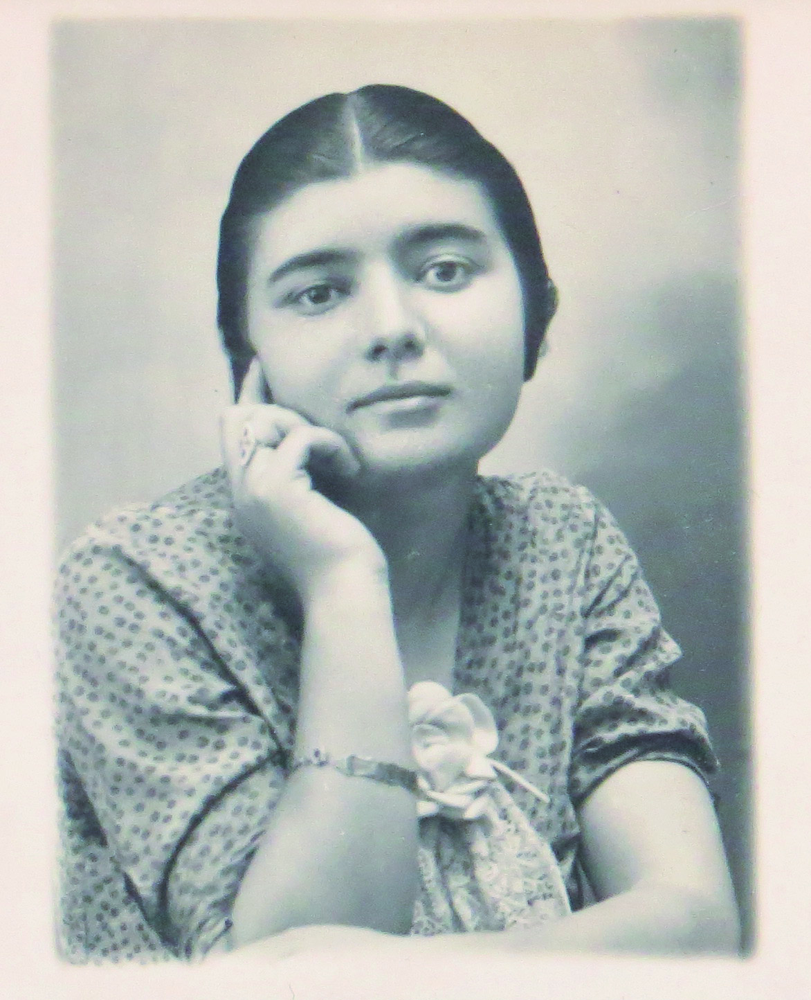

# A minha mãe

> * > * ***"Diz-se que o luto, com o seu trabalho progressivo, apaga lentamente a dor. Eu não podia nem posso acreditar nisso, porque, para mim, o Tempo elimina a emoção da perda (não choro), é tudo. Quanto ao resto, tudo ficou imóvel. Porque aquilo que eu perdi não é uma Figura (a Mãe), mas um ser; e não um ser, mas uma qualidade (uma alma): não o indispensável, mas o insubstituível. Eu podia viver sem a Mãe (todos nós podemos, mais cedo ou mais tarde); mas a vida que me restava seria certamente e até ao fim inqualificável (sem qualidade)."***  Roland Barthes, *A Câmara Clara*, pp. 85-6
