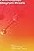

# Publications 
######  | [Dissertations](#Dissertations) | [Books (author)](#Books-author) | [Books (editor)](#Books-editor) | [Chapters](#Chapters) | [Encyclopaedia entries](#Encyclopaedia-entries) | [Articles](#Articles) | [Book reviews](#Book-reviews) | [Scholar brochures](#Scholar-brochures) | [Room texts](#Room-texts-at-exhibitions) | [Book series editor](#Book-series-editor) | [Journal editor](#Journals-editor) | [Journal guest editor](#Journals-guest-editor) | [Preprints and working papers](#Preprints-and-working-papers)

## Dissertations

* Pombo, Olga (1986) - **Leibniz e o Problema de uma Língua Universal**, Master dissertation in “Modern Philosophy” Faculty of Social and Human Sciences, New University of Lisbon (**[table of contents](https://webpages.ciencias.ulisboa.pt/~ommartins/leibniz/leibnizcont.htm)**)
* Pombo, Olga (1998) - **Unidade da Ciência e Configuração Disciplinar dos Saberes. Contributos para uma Filosofia do Ensino** PhD dissertation in “History and Philosophy of Education”, University of Lisbon (**[abstract](https://webpages.ciencias.ulisboa.pt/~ommartins/investigacao/tese.htm)**)
  

## Books (author)

1.	Pombo, Olga (1987) **[Leibniz and the Problem of a Universal Language](https://webpages.ciencias.ulisboa.pt/~ommartins/pdfs/Leibniz%20and%20the%20Problem%20of%20a%20Universal%20Language.pdf)**, Münster: Nodus Publikationen, 321 pp.  ISBN 3-89323-303-2 
2.	Pombo, Olga (1993) with Teresa Levy and Henrique Guimarães, **[A Interdisciplinaridade: Reflexão e Experiência](https://biblioteca.cm-valedecambra.pt/nyron/Library/catalog/winlibsrch.aspx?skey=96427A1FC89A4AF28279FA03D2B7FE15&pesq=5&thes1=9831&dtype=lista&doc=8527) Interdisciplinarity: Reflection and Experience**, Lisboa: Texto, 96 pp. ISBN 972-47-0462-9. (2nd revised and extended edition, 1994, 102 pp. ISBN 978-9724704623).
3.	Pombo, Olga (1997) **[Leibniz e o Problema de uma Língua Universal](https://www.researchgate.net/publication/259932965_Olga_Pombo_Leibniz_e_o_Problema_de_uma_Lingua_Universal_Lisboa_ed_JNICT_1997_320_p)** (portuguese revised translation of “Leibniz and the Problem of a Universal Language”), Lisboa: ed. Junta Nacional de Investigação Científica e Tecnológica (JNICT), 320 pp. ISBN: 972-9493-29-4. (Recensao de Marcos Silva [here](https://repositorio.ufc.br/bitstream/riufc/24066/1/2013_art_masilva.pdf))
4.	Pombo, Olga (2000) **[Quatro Textos Excêntricos. Hannah Arendt, Eric Weil, Bertrand Russell e Ortega Y Gasset](  https://www.relogiodagua.pt/produto/quatro-textos-excentricos/)** / **Four Eccentric Texts. Hannah Arendt, Eric Weil, Bertrand Russell and Ortega Y Gasset**,  Lisboa: Relógio d'Água, 105 pp. ISBN: 9789727085699,([from the preface](https://relogiodagua.pt/wp-content/uploads/2016/03/9789727085699.pdf?_ga=2.200381158.979288248.1742230490-919247224.1742230490))
5.	Pombo, Olga (2002) **[A Escola, a Recta e o Círculo](https://www.relogiodagua.pt/produto/a-escola-a-recta-e-o-circulo/) / The School, the Straignt Line and the Circle**,  Lisboa: Relógio d'Água, 316 pp. ISBN: 9789727086788. ([from the preface](https://relogiodagua.pt/wp-content/uploads/2016/03/9789727086788.pdf?_ga=2.101117633.1582267943.1742230671-2139208584.1742230671))
> ###### *Gods do not go to school. Not only because they already know everything, but because, even if they didn’t, they would have all the time in the world to learn. But humans beings are not immortal, and the precariousness of life has imposed the urgency of school, the imperative of teaching*.
7.	Pombo, Olga (2004) **[Interdisciplinaridade: Ambições e Limites](https://www.relogiodagua.pt/produto/interdisciplinaridade-ambicoes-e-limites/) / Interdisciplinarity: Ambitions and Limits**, Lisboa: Relógio d'Água, 203 pp. ISBN: 9789727088140. ([from the preface](https://relogiodagua.pt/wp-content/uploads/2016/03/9789727088140.pdf?_ga=2.144709876.1574178374.1742230807-1354625093.1742230807) and [here](https://webpages.ciencias.ulisboa.pt/~ommartins/investigacao/interdisc%20excertos.htm))
8.	Pombo, Olga (2006) **[Unidade da Ciência. Programas, Figuras e Metáforas](https://webpages.ciencias.ulisboa.pt/~ommartins/investigacao/livro_olga_uc.htm) / Unity of Science. Programs, Figures and Metaphors**, Lisboa: Duarte Reis, 324 pp. ISBN: 972-8745-27-3, 2nd edition, Lisboa: CFCUL/Gradiva, 2011, 343 pp). ISBN: 978-989-8247-41-4. 
(Recensao de Marina Lopes [here](https://webpages.ciencias.ulisboa.pt/~ommartins/investigacao/livroolga_uc_por_marina_lopez.pdf))
(Recensao de José Antonio Alves [here](https://webpages.ciencias.ulisboa.pt/~ommartins/pdfs/unidade%20da%20ciencia-%20recensao2.pdf)) 
9.	Pombo, Olga (2010) **[Palavra e Esplendor do Mundo. Estudos sobre Leibniz](https://www.bertrand.pt/livro/palavra-e-esplendor-do-mundo-olga-pombo/10283362?srsltid=AfmBOopSgGKw8qne823QfupWsimYHZsugmNNMFZFqP1EFsq65V9g_d6i) / Word and World Splendor. Studies on Leibniz**, Lisboa: Fim de Século, 300 pp. ISBN: 978-972-754-280-2.
10.	Pombo, Olga (2012) **[Os Círculos do Saber](https://www.bing.com/images/search?view=detailV2&ccid=RTbawchP&id=FAA19694B8EB723676E296F72D84B7E6027EFC3F&thid=OIP.RTbawchP4aLdww3KWI7UaAAAAA&mediaurl=https%3A%2F%2Fwww.researchgate.net%2Fprofile%2FOlga-Pombo%2Fpublication%2F303967245_Circulo_dos_saberes%2Fdata%2F5760a9e808ae2b8d20eb6649%2FCirculo-dos-saberes.jpg%3Forigin%3Dpublication_list&cdnurl=https%3A%2F%2Fth.bing.com%2Fth%2Fid%2FR.4536dac1c84fe1a2ddc30dca588ed468%3Frik%3DP%252fx%252bAua3hC33lg%26pid%3DImgRaw%26r%3D0&exph=387&expw=265&q=9.+pombo%2c+olga+2012+os+c%c3%adrculos+do+saber&form=IRPRST&ck=D8C8F90996D10423D75D72DFA31C1A9D&selectedindex=0&itb=0&ajaxhist=0&ajaxserp=0&vt=0&sim=11) / The Circles of Knowledge**, Lisboa: CFCUL/Gradiva, 314 pp. ISBN: 978-989-8247-53-7.
11.	Pombo, Olga (2013) **[Tarefas da Filosofia da Ciência para o Século XXI](https://bibliografia.bnportugal.gov.pt/bnp/bnp.exe/registo?1865876) / Tasks of the Philosophy of Science for the 21st Century**, Lisboa: CFCUL, 217 pp. ISBN: 978-989-8247-60-5. ([cover](http://cfcul.fc.ul.pt/publicacoes/capas/2013/TarefasdaEpistemologia.jpg))
12.	Pombo, Olga (2021), **Minha Prosa Antiga como Dantes / My Ancient Prose as It Used to Be**, Lisboa: Aletheia, 31 pp.
13.	Pombo, Olga (2021) **[Interdisciplinaridade. Ambições e Limites](https://www.bing.com/images/search?view=detailV2&ccid=zy1rStdp&id=502E88A331FC913316BAC19267B02CE76DE81B50&thid=OIP.zy1rStdp4UK8IjbtHLtOAwHaLW&mediaurl=https%3a%2f%2fimg.wook.pt%2fimages%2finterdisciplinaridade-ambicoes-e-limites-olga-pombo%2fMXwyNDc1NTkzNXwyMDkyMTgyN3wxNjIwMzE3NDY1MDAw%2f550x&cdnurl=https%3a%2f%2fth.bing.com%2fth%2fid%2fR.cf2d6b4ad769e142bc2236ed1cbb4e03%3frik%3dUBvobecssGeSwQ%26pid%3dImgRaw%26r%3d0&exph=843&expw=550&q=interdisciplinaridade.+ambi%c3%a7%c3%b5es+e+limites+aletheia&FORM=IRPRST&ck=33F1B40A9B58905A5643EC990735C709&selectedIndex=0&itb=0&idpp=overlayview&ajaxhist=0&ajaxserp=0)/ Interdisciplinarity: Ambitions and Limits** (revised edition),  Lisboa: Aletheia, 211 pp X. ISBN: 978-989-8906-94-6 (**full book [here](https://cfcul.ciencias.ulisboa.pt/wp-content/uploads/2023/10/Interdisciplinaridade_OPombo_livro.pdf)**)
###### *The controversy surrounding the concept of discipline is of fundamental importance for understanding what is meant by interdisciplinarity. If disciplines are merely social entities, groups of individuals brought together mainly for institutional and contingent reasons —that is, flexible and porous entities — then the advancement of interdisciplinary practices will easily lead to the progressive disappearance of disciplines. As interdisciplinary intersections intensify, disciplines tend to lose their boundaries and, consequently, to disappear. Interdisciplinarity can then be defined as the overcoming of disciplinary boundaries. On the contrary — and this is the approach I fully endorse — if disciplines continue to be understood as robust entities with a fundamental cognitive profile, domains of research activity with theoretical identity, history and specific development, then interdisciplinarity has nothing to do with either the merging or the disappearance of disciplines and their productive capacity. Interdisciplinarity should be understood not as a demand to abandon disciplines or blur their boundaries, but simply as something that exists between disciplines, that lives because disciplines exist. It is because disciplines exist as recognizable entities that interdisciplinarity can cross them, circulate among them, and work with them, within their boundaries*.
15.	Pombo, Olga (2022), [**Estudos de Filosofia da Ciência / Studies in Philosophy of Science**](https://cfcul.ciencias.ulisboa.pt/wp-content/uploads/2023/09/FilosofiaDaCiencia_OP_2022.pdf), Lisboa: Mariposa Azul, 348 pp. ISBN: 978-972-8481-74-2 (**full book [here](https://cfcul.ciencias.ulisboa.pt/wp-content/uploads/2023/09/FilosofiaDaCiencia_OP_2022.pdf)**)
16.	Pombo, Olga (2022), **[O Insuportável Brilho da Escola. Elementos para uma Filosofia da Escola e do Ensino](https://www.aletheia.pt/products/o-insuportavel-brilho-da-escola)/The Unbearable Brightness of School. Elements for a Philosophy of School and Teaching**, Lisboa: Aletheia, 2022, 285 pp. ISBN: 978-989-9077-76-8. (**full book [here](https://cfcul.ciencias.ulisboa.pt/wp-content/uploads/2023/10/brilho-escola-opombo-livro.pdf)**)
17.	Pombo, Olga (2024), **Estudos de Ciência e Arte / Studies on Science and Art**, Lisboa: Mariposa Azul (forthcoming) 
18.	Pombo, Olga (2024), **Deriva a partir de Rousseau / Derives from Rousseau**, Lisboa: Mariposa Azul (forthcoming)

## Books (editor)

1.	Olga Pombo; Teresa Levy; Henrique Guimarães (eds.) (1990) **Antologia I. Ciência Integrada, Interdisciplinaridade e Ensino Integrado das Ciências**, Lisboa: Mathesis / DEFCUL, 177 pp., DL: 44162/90.
2.	Olga Pombo; Teresa Levy; Henrique Guimarães; José Manuel Conceição (eds.) (1992) **Antologia II. Ciência Integrada, Interdisciplinaridade e Ensino Integrado das Ciências**,  Lisboa: Mathesis / DEFCUL, 214 pp. 
DL: 56340/92.
3.	Olga Pombo; Teresa Levy; Henrique Guimarães (eds.) (2006) [**Interdisciplinaridade. Antologia**](https://philpapers.org/rec/POMIA), Porto: Campo das Letras, 303 pp.. ISBN: 989-625-042-1.
4.	Olga Pombo; António Guerreiro; António Franco Alexandre (eds.) (2006) **[Enciclopédia e Hipertexto](https://www.goodreads.com/book/show/13500237-enciclop-dia-e-hipertexto) /Encyclopaedia and Hypertext**, Lisboa: Editora Duarte Reis, 556 pp., ISBN: 972-8745-22-2. 
5.	Olga Pombo; Manuel Beirão; J. Cordovil (eds) (2006) **As Cartas de Problemática de António Sérgio**, series “Cadernos de Filosofia das Ciências”, vol. 3, Lisboa: CFCUL, 217 pp. ISBN: 972-99794.2.1.
6.	Olga Pombo; Alexander Gerner (eds.) (2007) **[Abduction and the Process of Scientific Discovery](https://www.researchgate.net/profile/Olga-Pombo/publication/281806489_Abduction_and_the_Process_of_Scientific_Discovery_Olga_Pombo_Alexander_Gerner_Lisboa_CFCUL_Publidisa_2007_386_pp_for_the_series_Documenta/links/5ec1b712299bf1c09ac4b861/Abduction-and-the-Process-of-Scientific-Discovery-Olga-Pombo-Alexander-Gerner-Lisboa-CFCUL-Publidisa-2007-386-pp-for-the-series-Documenta.pdf?origin=publication_list)**, Lisboa: CFCUL / Publidisa, series “Documenta”, vol. 1, 386 pp., ISBN: 264501/07.
7.	Olga Pombo; Angel Nepomuceno (eds.) (2009) [**Lógica e Filosofia da Ciência / Logic and Philosophy of Science**](https://bibliografia.bnportugal.gov.pt/bnp/bnp.exe/q?mfn=134331&qf_AU==JORNADAS%20IBERICAS%20LOGICA%20E%20FILOSOFIA%20DA%20CIENCIA.%203.%20LISBOA.%202008), Lisboa: CFCUL / CRUP, series “Documenta”, vol. 2, 283 pp., ISBN: 978-989-8247-00-1.
8.	Olga Pombo; Silvia di Marco; Marco Pina (eds.) (2010) **[Neuroaesthetics, Can Science explain Art?](https://www.wook.pt/livro/neuroaesthetics-olga-pombo/10287054?srsltid=AfmBOopp7ynMsoHdUSpFQxPNycGY2psbDf3yEDV_OuNAqBCdKqSFKngA)**,  Lisboa: Fim de Século,175 pp., ISBN: 9789727542765. (also [here](https://www.amazon.com/Neuroaesthetics-Can-Science-Explain-Portuguese/dp/972754276X))
9.	Olga Pombo; Alexander Gerner (eds.) (2010) **[Studies in Diagrammatology and Diagram Praxis](https://www.amazon.com/Studies-Diagrammatology-Diagram-Praxis-Logic/dp/1848900074)**, London: College Publications, 224 pp., ISBN: 978-184-8900073 (see also ).
10.	Olga Pombo; Silvia di Marco (eds.) (2010) **[As Imagens com que Ciência se Faz](https://www.fnac.pt/As-Imagens-com-que-a-Ciencia-se-Faz-POMBO-OLGA-E-SILVIA-DI-MARCO/a341870) / Images with which Science is Done**, Lisboa: Fim de Século, 286 pp., ISBN: 978-972-754-279-6.
11.	Olga Pombo (ed.) (2011) **[Lógica Universal e Unidade da Ciência](https://bibliografia.bnportugal.gov.pt/bnp/bnp.exe/q?mfn=150407&qf_AU==JORNADAS%20IBERICAS%20%22LOGICA%20UNIVERSAL%20E%20UNIDADE%20DA%20CIENCIA%22.%205.%20LISBOA.%202010) /Universal Logic and Unity of Science**, Lisboa: CFCUL,196 pp., ISBN: 978-989-8247-50-6.
12.	Olga Pombo; Catarina Nabais; Cristina Tavares; Manuel Valente Alves; Marco Pina; Pedro Silva; Ricardo Santos; Silvia Di Marco (eds.) (2011) [**CorpoIMAGEM - Uma exposição de Ciência e Arte / BodyIMAGE - An exhibition of Science and Art**](https://www.researchgate.net/publication/303053499_Roteiro_da_exposicao_corpoIMAGEM_Representacoes_do_Corpo_na_Ciencia_e_na_Arte),  Lisboa: Ciência Viva, 27 pp. (catalogue).
13.	Olga Pombo; John Symons; Juan Manuel Torres (eds.) (2011) **[Otto Neurath and the Unity of Science](<https://link.springer.com/book/10.1007/978-94-007-0143-4>)**, Dordrecht/Heidelberg/ London/New York: Springer, 250 pp., ISBN: 978-94-007-0142-7. ; DOI: 10.1007/978-94-007-0143-4
15.	Olga Pombo; João Cord. (eds.) (2012) **As Cartas de Problemática de António Sérgio dirigidas a um grupo de jovens amigos, alunos e alunas da Faculdade de Ciências**,  Lisboa: Fim de Século, 228 pp.
ISBN: 978-972-754-294-9.[(here)](https://aviagemdosargonautas.net/2012/04/29/cfcul-as-cartas-de-problematica-de-antonio-sergio-olga-pombo-e-joao-luis-cordovil-org/)
16.	Olga Pombo; Shahid Rahman; John Symons; Juan Manuel Torres (eds.) (2012) **[Special Sciences and the Unity of Science](https://link.springer.com/book/10.1007/978-94-007-2030-5)**, Dordrecht/Heidelberg/London/New York: Springer, 299 pp., ISBN: 978-94-007-2029-9.; 
DOI: 10.1007/978-94-007-2030-5. 
17.	Olga Pombo; Marco Pina (eds.) (2012) **[Em torno de Darwin](https://www.wook.pt/livro/em-torno-de-darwin-marco-pina/12735819?srsltid=AfmBOooUJlkNPkxYQwyuhA9dLnO5j3I34un_OUmuUhVrpWgVQVLC-EaG) / On Darwin**,  Lisboa: Fim de Século, 187 pp. ISBN: 978-972-754-291-8. (also [here](https://www.amazon.com.br/Torno-Darwin-Marco-Pina-Pombo/dp/9727542913))
18.	Olga Pombo; António Guerreiro (eds.) (2012) **[Da Civilização da Palavra à Civilização da Imagem](https://www.wook.pt/livro/da-civilizacao-da-palavra-a-civilizacao-da-imagem-olga-pombo/15066641?srsltid=AfmBOooBxsXSn5EdbZrvIY7zDyYR_1v0fjyWqNypdDa_Zu3mSFwcY1YI) /From word civilization to Image Civilization**, Lisboa: Fim de Século, 186 pp., 
ISBN: 978-972-754-293-2.
19.	Olga Pombo; Nuno Melim (eds.) (2013) **[Rousseau e as Ciências](https://bibliografia.bnportugal.gov.pt/bnp/bnp.exe/registo?1865764&cl=en) /Rousseau and the Sciences** , Lisboa: CFCUL, 222 pp., ISBN: 978-989-8247-63-6.
20.	Olga Pombo; Nuno Nabais (eds.) (2013) **[O Lugar da Filosofia da Ciência na Universidade de Lisboa](https://www.amazon.com.br/lugar-filosofia-ci%C3%AAncia-universidade-lisboa/dp/9898247614) /The place of Philosophy of Science at the University of Lisbon**, Lisboa: CFCUL, 250 pp., ISBN: 978-989-8247-61-2.
21.	Juan Redmond; Olga Pombo; Ángel Nepomuceno (eds) (2016) **[Epistemology, Knowledge and the Impact of Interaction](https://link.springer.com/book/10.1007/978-3-319-26506-3)**, series “Logic, Epistemology, and the Unity of Science”, vol. 38, Switzerland: Springer International Publishing, 554 pp., ISBN: 978-3-319-26504-9; DOI: 10.1007/978-3-319-26506-3.
22.	Olga Pombo; Gil Costa (eds.) (2016) [**Philosophy of Science in the XXI Century: Challenges and Tasks**](https://run.unl.pt/bitstream/10362/28621/1/NunoFonseca.pdf), Lisboa: CFCUL, 352 pp., ISBN: 978-989-8247-72-8. (**full book [here](https://research.unl.pt/ws/portalfiles/portal/3352158/NunoFonseca.pdf)**)
23.	Olga Pombo; Ricardo Santos (eds.) (2016) **[Afinal, o que é a Ciência? Relatório de um Projecto](https://www.researchgate.net/publication/303967324_Afinal_o_que_e_a_ciencia_Relatorio_de_um_projecto)**, Lisboa: Ciência Viva, 122 pp. ISBN: 978-989-8247-70-4. (see [**here**](https://bibliografia.bnportugal.gov.pt/bnp/bnp.exe/registo?1947167))
24.	Olga Pombo; Paulo Castro (eds.) (2017) **[Debates da Filosofia da Ciência Contemporânea](https://bibliografia.bnportugal.gov.pt/bnp/bnp.exe/registo?mfn=198399&cl=en)**, Lisboa: CFCUL, 392 pp., ISBN: 978-989-8247-75-9.
25.	Olga Pombo (ed.) (2017) **[Image in Science and Art](https://www.wook.pt/livro/image-in-science-and-art-olga-pombo/23416273?srsltid=AfmBOopGcdI4udaOzItmaQJPAN2niamcpz5IJEAqtt0BA4fN1w0u9Mu4)**, Lisboa: Fim de Século, 231 pp. ISBN: 978-972-574-286-4. **(also [here](https://www.researchgate.net/publication/338346248_Image_in_Science_and_Art))**
26.	Olga Pombo (ed.) (2018) **[Modelos e Imagens /Models and Images](https://www.wook.pt/livro/modelos-e-imagens-olga-pombo/21821748?utm_source=paginasautores&utm_campaign=wookacontece&utm_medium=wookacontece)**, Lisboa: Fim de Século, 299 pp. ISBN: 978-972-754-287-1.
27.	Olga Pombo; Ana Pato; Juan Redmond (eds) (2018) **[Epistemologia, Lógica e Linguagem](https://bibliografia.bnportugal.gov.pt/bnp/bnp.exe/registo?2040823) /Epistemology, Logic and Language**, Lisboa: CFCUL, Series “Documenta”, vol. 11, 189 pp., ISBN: 78-989-8247-78-0.
28.	Olga Pombo; Catarina Nabais; Sara Fuentes (eds.) (2019), **[CorpoIMAGEM. Representações do Corpo na Ciência e na Arte](https://www.fnac.pt/CorpoIMAGEM-Representacoes-do-Corpo-na-Ciencia-e-na-Arte-Olga-Pombo/a7497228) /BodyIMAGE - Body Representations in Science and Art**, Lisboa: Fim de Século, 249 pp. ISBN: 978-972-754-285-7
29.	Jens Alwood; Olga Pombo; Clara Renna; Giovanni Scarafile (eds.)(2020) **[Controversies and Interdisciplinarity. Beyond Disciplinary Fragmentation for a new Knowledge Model](https://www.degruyter.com/document/doi/10.1075/cvs.16/html?srsltid=AfmBOoqkwUzOIU2RahX9oucBCXhxphnDJxdk4HeTxU1X7qd5lJ33u4Rq)**, Amsterdam/Philadelphia: John Benjamin’s Publishing Company, series “Controversies. Ethics and Interdisciplinarity”, vol. 16, 279 pp. ISBN - Hb: 978 90 272 0754 8; E-book: 978 90 272 6075 8;   DOI: https://doi.org/10.1075/cvs.16
30.	Olga Pombo (ed.) (2021),  **[Ciência, Racionalidade e Política. Ensaios (in)Atuais](https://www.fnac.pt/Ciencia-Racionalidade-e-Politica-Ensaios-In-Atuais-Olga-Pombo/a8512715) /Science, Rationality and Politics. (In)Actual Essays**, Lisboa: Aletheia, ISBN: 978-989-8906.  **[cover](images/livro-racionalidade-aletheia.webp)**
31.	Olga Pombo (ed.) (2021), [**Regresso ao Protágoras, de Platão / Return to Plato's Protagoras**](https://cfcul.ciencias.ulisboa.pt/wp-content/uploads/2023/09/Prota%CC%81goras_OP_2021.pdf), Lisboa: Mariposa Azul, 227 pp.; ISBN:978-972-8481-70-4
 (**full book [here](https://cfcul.ciencias.ulisboa.pt/wp-content/uploads/2023/09/Prota%CC%81goras_OP_2021.pdf)**)
###### *Everything separates us from the world that Plato conceived and recreated with sublime artistry. Yet we long to return. Not to witness the naïve beginnings of what we now possess in its developed form, but to ponder, to reconstruct, and, if possible, to rediscover (to absorb) something of the greatness of those unique moments of the ancient world. Not to lament the vast amount that has been lost, nor to celebrate all that has been gained. But to regain strength, to rekindle desire, to reinforce the impulse that might carry us toward a time in which the philosophical, artistic, communicative, and democratic aspirations then constituted may once again become possible*.
33.	Olga Pombo, Klaus Gaertner, Jorge Jesuíno (eds.) (2023), **[Theory and Practice in the Interdisciplinary Production and Reproduction of Scientific Knowledge.  Interdisciplinarity in the XXI Century](https://link.springer.com/book/10.1007/978-3-031-20405-0)**, Dordrecht / Heidelberg / London /New York: Springer, series “Logic, Argumentation & Reasoning”, vol. 31, 309 pp. ISBN: 978-3-031-20404-3; DOI: https://doi.org/10.1007/978-3-031-20405-0.

## Chapters

1.	Pombo, Olga (1979), **[Biobibliografia de Jean-Jacques Rousseau](https://webpages.ciencias.ulisboa.pt/~ommartins/investigacao/biobibliografia.pdf)** (Bibliography of Jean Jacques Rousseau), in *Jean-Jacques Rousseau. Uma Exposição*, Lisboa: Sociedade Portuguesa de Filosofia, pp. 5-44. 
2.	Pombo, Olga, (1988), “**Notas sobre as Instituições da Filosofia**”, in *A Filosofia face à Cultura Tecnológica*, edited by Adelino Cardoso, Coimbra: Associação de Professores de Filosofia, pp. 71-89. 
3.	Pombo, Olga (1988), **“Leibnizian Strategies for the Semantical Foundation of the Universal Language”**, in *Leibniz, Tradition und Aktualitat. V. Internationaler Leibniz-Kongress*, vol. 1, edited by Ernest Albrecht, Hannover: Gottfried-Wilhelm Leibniz-Gesellschaft, pp. 753-760. ISBN: 3-9800978-2-X 
4.	Pombo, Olga (1990), **“Dilema do Ensino da Filosofia”**, in *Didáctica da Filosofia*, vol. 2, edited by Isabel Marnoto, Lisboa: Universidade Aberta, pp. 7-30. ISBN: 9726740282
5.	Pombo, Olga (1990), **“The Leibnizian Theory of Representativity of the Sign”**, in *History and Historiography of Linguistics*, vol. II, edited by Hans-Joseph Niederehe; Konrad Koerner, Amsterdam/Philadelphia: John Benjamins Publishing Company, pp. 447-59, “Studies in the History of the Language Sciences”. DOI: https://doi.org/10.1075/sihols.51.2.06pom
6.	Pombo, Olga (1991), **“Hegel e a Linguagem: Estudo em forma de Prefácio ou de Introdução”**, in *Dinâmica do Pensar: Homenagem a Oswaldo Market*, Lisboa: Departmento de Filosodia, Faculty of Letters, Universidade de Lisboa, pp. 189-215. DL: 43.602/91.
7.	Pombo, Olga (1991), **“Epistemologia, Linguagem (da Química) e Ensino. Algumas Observações Interdisciplinares”**, in *Química, Encruzilhada de Disciplinas, Actas do Colóquio "Ensino superior da Química em línguas internacionais de origem latina"*, edited by Maria Elisa Pestana and Mariana Pereira, Lisboa: Sociedade Portuguesa de Química, pp. 144-156. 
8.	Pombo, Olga (1994), **“Contribuição para um Vocabulário sobre Interdisciplinaridade”**, in *Interdisciplinaridade: Reflexão e Experiência*, edited by O. Pombo; T. Levy; H. Guimarães, Lisboa: Texto Editora, pp. 92-97. ISBN 978-9724704623
9.	Pombo, Olga (1994), **“Apresentação de um Projecto”**, in *McLuhan. A Escola e os Media, 1º Caderno de História e Filosofia da Educação*, edited by Olga Pombo, Lisboa: DEFCUL, pp. 1-8.
10.	 Pombo, Olga (1994), [**“O Meio é a Mensagem”**](https://webpages.ciencias.ulisboa.pt/~ommartins/images/hfe/cadernos/mcluhan/estudo_mcl_olga.pdf), in *McLuhan. A Escola e os Media, 1º Caderno de História e Filosofia da Educação*, edited by Olga Pombo, Lisboa: DEFCUL, pp. 40-50.
11.	 Pombo, Olga (1994),**“A Matemática e o Trabalho de 'Dar a Ver'”**, in *PROFMAT/92, Actas do Encontro Nacional de Professores de Matemática de 1992*, Viseu: APF, pp. 35-39.
12.	 Pombo, Olga (1995), **“Nota de Abertura”**, in *Dois Textos sobre Educação. Hannah Arendt e Eric Weil, 2º Caderno de História e Filosofia da Educação*, edited by Olga Pombo, Lisboa: DEFCUL, pp. 1-2. 
13.	 Pombo, Olga (1996), **“A Matemática e o trabalho de dar a ver”**, in *Dez Anos de PROFMAT. Intervenções*, edited by Henrique Guimarães, Lisboa: A.P.M., pp. 105-121 (reprint).  
14.	 Pombo, Olga (1996), **“Nota de Abertura”**, in *A Invenção da Escola na Grécia. Materiais de Estudo, 3º Caderno de História e Filosofia da Educação*, edited by Olga Pombo, Lisboa: DEFCUL, pp. 1-2.
16.	Pombo, Olga (1996), **”The Place of the ‘Dissertatio De Stylo Philosophico Nizolii’ in the Leibnizian Praise of the German Language”**, in *Italia ed Europa nella Linguistica del Rinascimento*, edited by Mirko Tavoni, Ferrara: Franco Cosimo Panini Editore/Istituto di Studi Rinascimentali, vol. II, pp. 57-67. ISBN: 8876866728 9788876866722
17.	Pombo, Olga (1996), **“Leibnizian Strategies for the Semantical Foundation of the Universal Language”**, in *Im Spiegel des Verstandes. Studien zu Leibniz*, edited by Klaus D. Dutz and Stefano Gensini, Münster: Nodus Publikationen, pp. 161-171.  ISBN: 3893232680
18.	Pombo, Olga (1997), **“Museu e Biblioteca. A Alma da Escola”**, in *O Museu de Alexandria, 4º Caderno de História e Filosofia da Educação*, edited by Olga Pombo, Lisboa: DEFCUL, pp. 3-21.
19.	 Pombo, Olga (2000), **“Comunicação e Construção do Conhecimento”**, in *Itinerários. Investigar em Educação*, edited by Odete Valente, Lisboa: CIE, pp. 755-760 (reprint).
20.	 Pombo, Olga (2000), **“Universidade. Regresso ao Futuro de uma Ideia”**, in *Itinerários. Investigar em Educação*, edited by Odete Valente, Lisboa: CIE, pp. 903-912.
21.	 Pombo, Olga (2001), **“A Escola como Memória do Futuro”**, in *Itinerários. Investigar em Educação*, edited by Odete Valente, Lisboa: CIE, pp. 151-156 (reprint).
22.	Pombo, Olga (2001), **“Nota de Abertura”**, in *Educar / Ensinar. Materiais de Estudo (anthology of texts by Olivier Reboul, Jacques Ulmann, John Passmore and Paul Hirst, with introduction and translation), 6º Caderno de História e Filosofia da Educação*, edited by Olga Pombo, Lisboa: DEFCUL, pp. 1-3.
23.	 Pombo, Olga (2002), **“Leibniz and the Encyclopaedic Project”**, in *La Actualidad de Leibniz. Actas del Congresso Internacional Ciência, Tecnologia Y Bien Comum*, Valência, 21-23 Marzo de 2001, edited by Agustín Andreu Rodrigo, Javier Echeverría Ezponda, Concha Roldán Panadero,  Valencia: Editorial de la Universidad Politecnica de Valencia, pp. 267-278. ISBN: 84-9705-205-6
24.	 Pombo, Olga (2002), **"Leibniz and the Encyclopaedic Project"**, in *Itinerários. Investigar em Educação*, edited by Odete Valente, Lisboa: CIE, pp. 155-163 (reprint).
25.	 Pombo, Olga (2002), **“Biblioteca. A Alma da Escola”**, in *Bibliotecas e Novas Tecnologias, Actas do Colóquio realizado no Forum Lisboa*, 11-13 de outubro 2000, Lisboa: Câmara Municipal de Lisboa, pp. 117-128.  ISBN: 972-8695-06-3.
26.	 Pombo, Olga (2003), **["O Insuportável Brilho da Escola"](https://webpages.ciencias.ulisboa.pt/~ommartins/investigacao/brilhoescola.pdf)**, in *Direitos e Responsabilidades na Sociedade Educativa*, edited by Alain Renaut et allii, Lisboa: Fundação Calouste Gulbenkian, pp. 31-59. ISBN 972-31-1081-4
27.	 Pombo, Olga (2004), **[Epistemologia da Interdisciplinaridade](https://webpages.ciencias.ulisboa.pt/~ommartins/investigacao/portofinal.pdf)**, in *Interdisciplinaridade, Humanismo Universidade*, edited by Carlos Pimenta, Porto: Campo das Letras, pp. 93-124. ISBN: 972-610-867-5
28.	 Pombo, Olga (2005), **“Clássicos: Inevitáveis!”**, in *Bloco de Nautas. XVI Encontro de Literatura para Crianças*, edited by Ana Gaiaz, Lisboa: Fundação Calouste Gulbenkian, pp. 149-185. DL: 255 384/05.
29.	 Pombo, Olga (2005), **“Nota de Abertura”**, in *Três Textos sobre Educação para um Mundo Difícil:  Bertrand Russell e Ortega Y Gasset, 7º Caderno de História e Filosofia da Educação*, edited by Olga Pombo, Lisboa: DEFCUL, pp. 1-4. 
30.	 Pombo, Olga (2006), **“Enciclopédia e Hipertexto. O Projecto”**, in *Enciclopédia e Hipertexto*, edited by Olga Pombo; António Guerreiro; António Franco Alexandre, Lisboa: Editora Duarte Reis, pp. 180-193.  ISBN: 972-8745.22.2
31.	 Pombo, Olga (2006), **“Para uma História da Ideia de Enciclopédia”**, in *Enciclopédia e Hipertexto*, edited by Olga Pombo; António Guerreiro; António Franco Alexandre, Lisboa: Editora Duarte Reis, pp. 194-251. ISBN: 972-8745.22.2
32.	 Pombo, Olga (2006), **“Leibniz and the Encyclopaedic Projec”**, in *Enciclopédia e Hipertexto*, edited by Olga Pombo; António Guerreiro; António Franco Alexandre, Lisboa: Editora Duarte Reis, pp. 252-265. ISBN: 972-8745-22-2 (reprint). 
33.	 Pombo, Olga (2006), **“Hipertexto como limite da ideia de enciclopédia”**, in *Enciclopédia e Hipertexto*, edited by Olga Pombo; António Guerreiro; António Franco Alexandre, Lisboa: Editora Duarte Reis, pp. 266-301. ISBN: 972-8745.22.2
34.	 Pombo, Olga (2006), **“As 'Cartas de Problemática' de António Sérgio e os Estudantes da Faculdade de Ciências da Universiade de Lisboa”**, in *As Cartas de Problemática de António Sérgio*, edited by Olga Pombo; M. Beirão; J. Cordovil, series “Cadernos de Filosofia das Ciências”, vol. 3, Lisboa: CFCUL, pp. 5-26. ISBN: 972-99794.2.1.
35.	 Pombo, Olga (2006), **“A Ciência e as Ciências”**, in *Encontro de Saberes*, coordenated by Ana Tostões et alii, Lisboa: Fundação Calouste Gulbenkian, pp. 515-532. ISBN: 972-31-1159-4
36.	 Pombo, Olga (2006), **“Agostinho da Silva. Um Arquétipo Vivo do Professor”**, in *In Memoriam de Agostinho da Silva. 100 Anos, 150 Nomes*, edited by Renato Epifânio; Romana V. Pinho; Amon Pinho Davi, Lisboa: Zéfiro / AAS, pp. 354-359. ISBN: 972-8958-24-2
37.	Pombo, Olga; Gerner, Alexander (2007), **"Preface"**, in *Abduction and the Process of Scientific Discovery*, edited by Olga Pombo; Alexander Gerner, Lisboa: CFCUL/Publidisa, pp. 7-10. ISBN: 264501/07
38.	Pombo, Olga (2008), [**“Unidade da Ciência. O Regresso de uma Ideia”**](https://webpages.ciencias.ulisboa.pt/~ommartins/curriculum/unidade%20da%20ciencia.%20regresso%20de%20uma%20ideia.pdf), in *A Unicidade do Conhecimento*, edited by Vítor Manuel Trindade; Maria de N. Trindade; Adelinda A. Candeias, Coimbra: Papel Munde, pp. 49-65. ISBN: 978-989-558-106-1.
39.	Pombo, Olga (2008), **"Imigrantes, Estrangeiros e Cidadãos. A partir de H. Arendt e B. Russell"**, in *Actas da Conferencia Ibérica Educação para a Cidadania*, edited by Florbela Sousa and Carolina Carvalho, Lisboa: DEFCUL/CIE, pp. 36-42 (CD Rom). ISBN: 978-989-95062-4-4.
40.	Pombo, Olga (2009), **”Characteristica Universalis e Transcendental Impuro. Apontamentos sob a Forma de um Testemunho”**, in *Paisagens dos Confins*, edited by Filomena Mölder, Lisboa: Vendaval, pp. 91-100. ISBN:  978-972-8984-08-3
41.	Pombo, Olga (2009), **“A Educação das Crianças dos 0 aos 12 anos. Implicações do Estudo”**, in *A Educação das Crianças dos 0 aos 12 anos. Relatório do Estudo, Actas do seminário realizado a 20 de maio de 2008 no Conselho Nacional de Educação*, edited by I. Alarcão; M. Miguéns, Lisboa: Editorial do Ministério da Educação, pp. 363-378. ISBN: 978-972-8360-57-3.
42.	Pombo, Olga (2009), [**“Palavras de Abertura”**](https://webpages.ciencias.ulisboa.pt/~ommartins/publicacoes%20opombo/abertura%20foucault.pdf), in *Lei, Segurança e Disciplina, Trinta anos depois de Vigiar e Punir de Michel Foucault*,  edited by A. F. Cascais; J. L. Câmara Leme; N. Nabais, Lisboa: CFCUL, pp. 11-13. ISBN: 978-989-8247-02-5
43.	Pombo, Olga (2010), **“As Imagens com que a Ciência se faz”**, in *As Imagens com que Ciência se Faz*, edited by Olga Pombo; Silvia di Marco, Lisboa: Fim de Século, pp. 9-20.  ISBN: 978-972-754-279-6
44.	Pombo, Olga (2010), **“Operativity and Representativity of the Sign in Leibniz”**, in *Studies in Diagrammatology and Diagram Praxis*, edited by Olga Pombo; Alexander Gerner, London: College Publications, pp. 1-11. [DOI:10.1007/978-3-319-15368-1_24](https://link.springer.com/chapter/10.1007/978-3-319-15368-1_24) 
45.	Pombo, Olga; Gerner, Alexander (2010), **“Preface”**, in *Studies in Diagrammatology and Diagram Praxis*, edited by Olga Pombo; Alexander Gerner, London: College Publications, pp. I-V.  ISBN: 978-184-8900073
46.	Pombo, Olga (2010), **”The Great Discovery of Hobbes' Philosophy of Language”**, in *Estudios de Lógica, Lenguaje y Epistemología*, edited by David Fernández Duque; Emilio F. Gómez Caminero; Ignacion Hernández Antón, Sevilla: Fénix, pp. 99-105. ISBN: 978-84-614-4291-1
47.	Pombo, Olga; di Marco, Silvia; Pina, Marco (2010), **“Introduction”**, in *Neuroaesthetics. Can Science explain Art?*,  edited by Olga Pombo; Silvia di Marco; Marco Pina, Lisboa: Fim de Século, pp. 9-20. ISBN: 9789727542765.
48.	Pombo, Olga (2010), **“Dispersão e Unidade: para uma Poética da Simpatia”**, in *Temas de Pesquisa em Ciência da Informação no Brasil*, edited by M. L. G. Lara; J. W. Smit, São Paulo: Escola de Comunicações e Artes,  Brazil, pp. 31-46. ISBN – 978-85-7205-081-4. 
49.	Pombo, Olga (2010), **“Otto Neurath. Uma Comovente Figura de Filósofo do século XX”**, in *Liber Amicorum Angel Nepomuceno*, edited by Fernando Soler; Hans van Ditmarsch; Francisco Salguero, Sevilla: Fénix Editora, pp. 109-116. ISBN: 978-84-614-5116-6.  
50.	Pombo, Olga (2010), **“Three Roots for Leibniz's Contribution to the Computational Conception of Reason"**, in *Programs, Proofs, Processes*, edited by Fernando Ferreira; B. Löwe; E. Mayordomo; L. M. Gomes, Berlin: Springer, pp. 352-361. ISBN: 978-3-642-13961-1
DOI:https://doi.org/10.2178/bsl/1309952324
51.	Pombo, Olga (2011), **“Neurath and the Encyclopaedic Project of Unity of Science”**, in *Otto Neurath and the Unity of Science*, edited by Olga Pombo; John Symons; Juan Manuel Torres, Dordrecht/Heidelberg/London/New York: Springer, pp. 59-70. DOI: 10.1007/978-94-007-0143-4_5.
52.	Pombo, Olga; Symons, John; Torres, Juan Manuel (2011), **“Neurath and the Unity of Science: Introduction”**, in *Otto Neurath and the Unity of Science*, edited by Olga Pombo; John Symons; Juan Manuel Torres, Dordrecht/ Heidelberg/ London/ New York: Springer, pp. 1-11.  
[DOI:10.1007/978-94-007-0143-4](https://link.springer.com/book/10.1007/978-94-007-0143-4)
53.	Pombo, Olga (2011), **“Para um Modelo Reflexivo da Formação de Professores”**, in *Utopia em Busca de Possibilidade - Abordagens Interdisciplinares no Ensino das Ciências da Natureza*, edited by Carlos A. dos Santos; Aline F. de Quadros, Foz do Iguaçu, Brazil: UNILA, pp. 13-26. ISBN: 978-85-7727-315-7
54.	Pombo, Olga (2011), **“Epistemologia e Ensino das Ciências”**, in *Utopia em Busca de Possibilidade - Abordagens Interdisciplinares no Ensino das Ciências da Natureza*, edited by Carlos A. dos Santos; Aline F. de Quadros (Orgs.), Foz do Iguaçu, Brazil: UNILA, pp. 27-49. ISBN: 978-85-7727-315-7
55.	Pombo, Olga (2011), **“Three Roots for Leibniz's Contribution to the Computational Conception of Reason”**, in *Lógica Universal e Unidade da Ciência+, edited by Olga Pombo, Lisboa: CFCUL, pp.183-196. ISBN: 978-989-8247-50-6 (reprint)
56.	Pombo, Olga (2011), **“Prefácio”**, in *Lógica Universal e Unidade da Ciência*, edited by Olga Pombo, Series “Documenta”, vol. 6.  Lisboa: CFCUL, pp. 9-10. ISBN: 978-989-8247-50-6
57.	Pombo, Olga (2012), **“Leibniz: Intuição e Simbolismo”**, in *Ensayos sobre Lógica, Lenguage, Mente y Ciência*, edited by L. F. Moreno; Francisco Salguero; Cristina Barés, Sevilla: Alfar, pp. 233-242.  ISBN 978-84-7898-462-6. (**more info [here](https://dialnet.unirioja.es/servlet/libro?codigo=839991)**)
58.	Pombo, Olga; Nabais, Catarina; Pina, Marco; Di Marco, Silvia (2012), **“Body-Image: Crossing Science and Art”**, in *Electronic Visualisation and the Arts*, EVA London 2012, edited by Stuart Dunn; Jonathan P. Bowen; Kia Ng, London: BCS, pp. 282-283. [DOI:10.1007/978-1-4471-5406-8_1](https://link.springer.com/chapter/10.1007/978-1-4471-5406-8_1) (**more info [here](https://www.academia.edu/86561470/Body_image_Crossing_science_and_art)**)
59.	Pombo, Olga (2012), **“Quatro Notas sobre Ciência, Filosofia e Filosofia da Ciência”**, in *Gravitações Bioéticas*, edited by António Barbosa; Fernando Martins Vale; Paulo Costa, Lisboa: Centro de Bioética da Faculdade de Medicina da University of Lisbon, pp. 241-256. ISBN: 978-972-9349-27-0
60.	Pombo, Olga; Reis dos Santos, Ricardo (2012), **“Darwin e a Ilustração Científica”**, in *Em Torno de Darwin*, edited by Olga Pombo; Marco Pina, Lisboa: Fim de Século, pp. 79-100. ISBN: 978-972-754-291-8
61.	Pombo, Olga; Pina, Marco (2012), **“Introdução”**, in *Em Torno de Darwin*, edited by Olga Pombo; Marco Pina, Lisboa: Fim de Século, pp. 9-23. ISBN: 978-972-754-291
62.	Pombo, Olga; Guerreiro, António (2012), **"Introdução"**, in *Da Civilização da Palavra à Civilização da Imagem*, edited by Olga Pombo; António Guerreiro, Lisboa: Fim de Século, pp. 9-15. ISBN: 978-972-754-293-2
63.	Pombo, Olga (2013), **“Rousseau, la Science et la Paix avec le Monde”**, in *Rousseau e as Ciências*, edited by Olga Pombo; Nuno Melim, Lisboa: CFCUL, pp. 7-26. ISBN: 978-989-8247-63-6
64.	Pombo, Olga (2013), **“O Livro como Extravagância”**, in *O Livr-o-men*, edited by C. Castelo; A. Silveiro Gomes, Lisboa: Barbara says..., pp. 121-139. ISBN: 978-989-96245-2-8
65.	Pombo, Olga (2013), **"Diderot, D'Alembert e o Movimento Enciclopedista"**, in *Dez Luzes num Século Ilustrado*, edited by Ana Isabel Santos; Ana Paula Jardim, Câmara Municipal de Oeiras, Lisboa: Editora Caminho, pp. 145-170. ISBN: 978-972-21-2620-5
66.	Pombo, Olga (2014), **“Prefácio”**, in *Pre-textos Bioéticos*, edited by António Barbosa, Lisboa: Faculdade de Medicina da Universidade de Lisboa, pp. IX-XI.
67.	Pombo, Olga (2014), **“A Estátua de Glauco ou afinal o que é a Escola?”**, in *Descobrir a face da Escola com a Inspiração de Alain e de Olga Pombo*, edited by João Barbosa, Lisboa: CFCUL, pp. 75-108. ISBN: 978-989-8247-67-4 (reprint).
68.	Pombo, Olga (2014), **“Unity of Science and Encyclopaedia: from the Idea to the Configurations”**, in *Perspectives on Theory of Controversies and The Ethics of Communication. Explorations of Marcelo Dascal's Contributions to Philosophy*, edited by Dana Riesenfeld; Giovanni Scarafile, Dordrecht/ Heidelberg/ London/ New York: Springer, Series “Logic, Argumentation & Reasoning”, pp. 157-172. DOI: 10.1007/978-94-007-7131-4
[DOI: 10.1007/978-94-007-7131-4](https://doi.org/10.1007/978-94-007-7131-4?nosfx=y))
69.	Pombo, Olga (2015), **"Operativity and Representativity of the Sign in Leibniz"**, in *The Road to Universal Logic. Festschrift for the 50th Birthday of Jean-Yves Béziau*, Vol. II, edited by Arnold Koslow; Arthur Buchsbaum, London/New York: Springer International Publishing, Series “Studies in Universal Logic”, pp. 557-564 (reprint). DOI: 10.1007/978-3-319-15368-1_24   **(full text [here](https://www.researchgate.net/publication/286919974_Operativity_and_Representativity_of_the_Sign_in_Leibniz)**
70. Redmond, Juan; Pombo, Olga; Nepomuceno, Ángel (2016), **“Preface”**, in *Epistemology, Knowledge and the Impact of Interaction*, edited by Juan Redmond; Olga Pombo; Ángel Nepomuceno, Series “Logic, Epistemology, and the Unity of Science” vol. 38, Switzerland: Springer International Publishing, pp. v-xiii. [DOI: 10.1007/978-3-319-26506-3](https://link.springer.com/book/10.1007/978-3-319-26506-3).
71. Pombo, Olga (2016), **"Introduction"**, in *Philosophy of Science in the XXI Century: Challenges and Tasks*, edited by Olga Pombo; Gil Costa, Lisboa: CFCUL, pp. 7-14. ISBN: 978-989-8247-72-8
72. Pombo, Olga (2016), **“Quatro Notas sobre Filosofia, Ciência e Filosofia da Ciência”**, in *Afinal, o que é a Ciência? Relatório de um Projecto*, edited by Olga Pombo; Ricardo Santos, Lisboa: CFCUL / Ciência Viva, pp.15-31 ISBN: 978-989-8247-70-4 (reprint).
73. Pombo, Olga (2016), **“Nota Introdutória”**, in *Afinal, o que é a Ciência? Relatório de um Projecto*, edited by Olga Pombo; Ricardo Santos, Lisboa: CFCUL / Ciência Viva, pp. 9-12. ISBN: 978-989-8247-70-
74. Pombo, Olga (2016), **“Sobre o trabalho de Revisão”**, in* Dentro de Mim só há Marão. Poemas de Maria do Rosário Pombo*, edited by Catarina Nabais (ed.), Lisboa: VASP DPS, pp. 15-30. ISBN: 978-989-20-7055
75. Pombo, Olga (2016), **"Bachelard: Ciência, Escola e Comunidade Científica"**, in *Bachelard. 50 ans après*, edited by Z. Kotowicz, Lisboa: CFCUL, pp. 9-24. ISBN 978-989-8247-73-5
76. Pombo, Olga (2017), **“Introduction”**, in *Image in Science and Art*, Lisboa, edited by Olga Pombo, Lisboa: Fim de Século, pp. 11-16. ISBN: 978-972-754-286-4
77. Pombo, Olga; Castro, Paulo (2017), **“Prefacio”**, in *Debates da Filosofia da Ciência Contemporânea*, edited by Olga Pombo; Paulo Castro, Lisboa: CFCUL, pp. 7-9. ISBN: 978-989-8247-75-9
78. Pombo, Olga (2017), **“Apresentação/Presentation”**, in *O mais Profundo é a Pele* (bilingual edition), edited by Barbara Coutinho, Lisboa: MUDE, pp.17-19, ISBN: 978-989-8772-08-4.
79. Pombo, Olga (2017), **“Leibnizian Grounds for the Idea of Universal Machine”**, in *Logic and Computation, Essays in honour of Amílcar Sernadas*, edited by C. Caleiro; F. Dionisio; P. Gouveia; P. Mateus; J. Rasga, London: College Publications, pp. 337-351. ISBN-13: 978-1848902480
80. Pombo, Olga (2018), **"Bachelard et la Cité Savante"**, in *Bachelard et l’Avenir de la Culture, Du Surrationalisme à la Raison Créative*, edited by Vincent Bomtemps, Paris : Presses des Mines, pp. 109-120. ISBN : 978-2-35671-499-2
81. Pombo, Olga (2018), **“Introdução"**, in *Modelos e Imagens*, edited by Olga Pombo, Lisboa: Fim de Século, pp. 9-20. ISBN: 978-972-754-287-1
82. Pombo, Olga (2018), **“Prefacio”**, in Barbosa, João, *Contributos para a Compreensão do Sucesso da Cosmologia do Big Bang. Uma Análise Thematica à Luz de Gerald Holton*, Lisboa: CFCUL (series “Theses”, vol. 7), pp. 11-18. ISBN: 978-989-8247-77-3
83. Pombo, Olga; Pato, Ana; Redmond, Juan (2018), **“Prefacio”**.  in *Epistemologia, Lógica e Linguagem*, edited by Olga Pombo; Ana Pato; Juan Redmond, Lisboa: CFCUL (series “Documenta”, vol.  11), pp. 11-13. ISBN: 978-989-8247-78-0
84. Pombo, Olga (2019), **“Acerca da ‘Brevis Designatio’”**, in *Leibniz e a Linguagem I. Linguas Naturais, Etimologia e História*, edited by William Piauí, Curitiba: Kotter Editorial, pp. 193-200 
ISBN: 978-65-80103-02-7
85. Pombo, Olga (2019), **“Razão, Cálculo e Computação. Três Raízes da Concepção Computacional da Razão em Leibniz”**, in *Turing. Cientista Universal*, edited by José Carlos Espírito Santo, Braga: Universidade do Minho Editora, pp. 119-135. DOI: https://doi.org/10.21814/uminho.ed.5 (**full issue [here](https://ebooks.uminho.pt/index.php/uminho/catalog/book/5]))**
86. Pombo, Olga (2019), **“CorpoIMAGEM. Uma exposição”**, in *CorpoIMAGEM. Representações do Corpo na Ciência e na Arte*, edited by Olga Pombo; Catarina Nabais; Sara Fuentes, Lisboa: Fim de Século, pp. 9-17. ISBN: 978-972-754-285-7
87. Pombo, Olga (2020), **“Science and Democracy. A complex relationship”**, in [*Controversies and Interdisciplinarity. Beyond Disciplinary Fragmentation for a new Knowledge Model*](https://www.researchgate.net/publication/344786798_Controversies_and_Interdisciplinarity_Beyond_disciplinary_fragmentation_for_a_new_knowledge_model), edited by Jens Allwood; Olga Pombo; Clara Renna; Giovanni Scarafile, Amsterdam / Philadelphia: John Benjamin’s Publishing Company, pp. 255-268. DOI:https://doi.org/10.1075/cvs.16.13pom
###### *The article analyses the relationship between science and democracy on basis of a very specific point of view. Three arguments are put forward to defend that. In its historical origin, in its linguistic roots and in its institutional basis, science is (and continues to be) a democratic endeavor. The article very briefly discusses the decisive changings in the relation between science and political, economic and military power that took place during the XX century and stresses the cognitive relevance of a set of universal institutions which, all along the history of science, provide the conditions of possibility for science to exist and develop. Finally, even if today those universal institutions face big transformations, the possibility for science to remain a free democratic endeavor is questioned and argued.*
89. Allwood, Jens; Pombo, Olga; Scarafile, Giovanni (2020), **“Crossing borderlines. Beyond the structure of parallel world views”**, in [*Controversies and Interdisciplinarity. Beyond Disciplinary Fragmentation for a new Knowledge Model*](https://www.degruyterbrill.com/document/doi/10.1075/cvs.16/html?srsltid=AfmBOooJ1aF--901cAAm37FkfE3ENkh7AkcgoA4fh8-PWgUaHrrbwi6s), edited by Jens Allwood; Olga Pombo; Clara Renna; Giovanni Scarafile, Amsterdam / Philadelphia: John Benjamin’s Publishing Company, pp. 1-4. DOI:https://doi.org/10.1075/cvs.16
90. Pombo, Olga (2020), **“Apresentação”**, in *Ciência, Racionalidade e Política. Ensaios (in)Atuais*, edited by Olga Pombo, Lisboa: Aletheia, pp. 7-9. ISBN: 978-989-8906
91. Pombo, Olga (2021), **“Natural Language and Philosophical Language. Nationalism and Universalism in Leibniz's position on the German language”**, in *Lógica, Conocimiento y Abducción. Homenaje Ángel Nepomuceno*, edited by Cristina Barés; Fernando Soler; Francisco Salguero, London: College Publications, pp. 205-218. ISBN: 978-1-84890-358-6
92. Pombo, Olga (2021), **“Razões para regressar ao Protágoras, de Platão. Em jeito de Introdução”(Reasons to Return to Plato’s Protagoras: An Introductory Gesture)**, in *Regresso ao Protágoras de Platão*, edited by O. Pombo, Lisboa: Mariposa Azul, pp. 9-57.  ISBN: 978-972-8481-70-4
93. Pombo, Olga (2021), **“Argumento e Racionalidade no Protágoras de Platão” Argument and Rationality in Plato’s Protagoras)**, in *Regresso ao Protágoras de Platão*, edited by O. Pombo, Lisboa: Mariposa Azul, pp. 213-227. ISBN: 978-972-8481-70
94. Pombo, Olga (2021), **“Apresentação”**, in Pombo, Olga, *Interdisciplinaridade: Ambições e limites (2nd Editions)*, Lisboa: Aletheia, pp. 9-15. ISBN: 978-989-8906-94-6
95. Pombo, Olga (2022), **“Men and Citizens. Actual Consequences of an Unconventional Distinction established by Rousseau”**, in [*In Difesa dell'Umano. Problemi e Prospettive*](https://vivariumnovum.it/saggistica/patmos/patmos/in-difesa-dellumano-i-volume), edited by L. Boi; U. Curi; L. Maffei; L. Miraglia, Frascati-Napoli: Edizioni Accademia Vivarium Novum - Bibliopolis, 2 vols, pp: 265-279. ISBN: 9788887637533
96. Pombo, Olga (2023), **“The Fundamental Cognitive Destiny of Interdisciplinarity”**, in *[Theory and Practice in the Interdisciplinary Production and Reproduction of Scientific Knowledge. Interdisciplinarity in the XXI Century](https://books.google.pt/books/about/Theory_and_Practice_in_the_Interdiscipli.html?id=td2mEAAAQBAJ&redir_esc=y)*, edited by Olga Pombo; Klaus Gaertner; Jorge Jesuino (eds.), Dordrecht /Heidelberg/London/New York: Springer, “Logic, Argumentation & Reasoning” vol. 31, pp. 3-58. ISBN: 978-3-031-20404-3 (**more info [here](https://philpapers.org/rec/POMTAP)**)
97.	Pombo, Olga (2023), “**Signs of Interdisciplinarity in the second half of XX century and Prospects for the XXI Century**”, in *Theory and Practice in the Interdisciplinary Production and Reproduction of Scientific Knowledge. Interdisciplinarity in the XXI Century*, edited by Olga Pombo; Klaus Gaertner; Jorge Jesuino, Dordrecht/Heidelberg/London/New York: Springer, “Logic, Argumentation & Reasoning” vol. 31, pp. 241-299. ISBN: 978-3-031-20404-3
98.	Pombo, Olga: Gaertner, Klaus; Jesuino, Jorge (2023), “**Introduction**”, in *Theory and Practice in the Interdisciplinary Production and Reproduction of Scientific Knowledge. Interdisciplinarity in the XXI Century*, edited by Olga Pombo; Klaus Gaertner; Jorge Jesuino, Dordrecht/ Heidelberg/ London/New York: Springer, “Logic, Argumentation & Reasoning” vol. 31, pp. ix-xvi. ISBN: 978-3-031-20404-3.
99.	Pombo, Olga, “**For a cartography of the concept of creation**”, in Nuno Proença (ed.), *Invention and Imagination*, IFILNOVA e Centro de Filosofia da Universidade de Lisboa (forthcoming).

## Encyclopaedia entries

1. Pombo, Olga (2013), **“Encyclopedia”**, in *Encyclopedia of Philosophy and the Social Sciences*, edited by Byron Kaldis, Los Angelos, London/New Delhi/Singapore/Wahington: Sage Publications, 2013, vol. I, pp. 253-257. DOI: http://dx.doi.org/10.4135/9781452276052

## Articles
  
1. Pombo, Olga et alii (2025), [**“On imagination. Editorial”**](https://journals.ku.edu/aion/article/view/24799/22086), *Aion. Journal of Philosophy and Science*, nº 2, pp. 1-3.
2. Pombo, Olga (2024), [**"Science et École chez Bachelard.  Discontinuité et Nouveauté"**](https://mimesisjournals.com/ojs/index.php/bachelardstudies/article/view/4961/3842), *Bachelard Studies / Études Bachelardiennes / Studi Bachelardiani*, nº 1-2, pp. 77-91. ISSN: 2724-5470, ISBN: 9791222317328, 
DOI: [10.7413/2724-5470100](https://doi.org/10.7413/2724-5470100).
3. Pombo, Olga et alii (2024), [**“On the Concept of Resistance. Editorial”**](https://journals.ku.edu/aion/article/view/23014/20807), *Aion. Journal of Philosophy and Science*, nº1, pp. 1-5. 
4. Pombo, Olga et alii (2024), [**“A fotografia entre a Ciência, a Arte e a Filosofia”**](https://ojs.letras.up.pt/index.php/RL/article/view/14498/12891), *Revelar. Revista de Estudos da Fotografia e Imagem*, vol. 7-8, pp. 13-16
5. Pombo, Olga (2021), [**Curiosidade e Ciência"**](https://electramagazine.fundacaoedp.pt/index.php/editions/edicao-12/curiosidade-e-ciencia), *Electra*, nº 12, pp. 167-180. ISNN: 2184-2018, ISBN: 978-989-54964-4-0,Doi: https://doi.org/10.5216/lahrs.v1.70672
6.  Pombo, Olga (2021), [**Curiosity and Science**](https://electramagazine.fundacaoedp.pt/index.php/en/editions/issue-12/curiosity-and-science), *Electra (English version)*, nº 12, pp. 167-180. ISNN: 2184-2018, ISBN: 978-989-54964-4-0,Doi: https://doi.org/10.5216/lahrs.v1.70672
7. Pombo, Olga (2021), [**“Interdisciplinaridade/Interdisciplinarity”**](https://revistas.ufg.br/lahrs/article/view/70672/37386), *Latin American Human Rights Studies (LAHRS)*, nº 1. ISNN: 2763-8162, DOI: <https://www.revistas.ufg.br/lahrs>
8. Pombo, Olga (2021), [**“Homens ou Cidadãos. A propósito da Chamada “Educação para a Cidadania”**](https://revistas.ufg.br/lahrs/article/view/69398), *Latin American Human Rights Studies Journal (LAHRS)*, vol.1. ISNN: 2763-8162.
###### *Rousseau, H. Arendt and B. Russell – are arguably great spirits. Arendt, an eternal foreigner and immigrant. Russell, an eloquent example of what a world citizen can be. Rousseau, someone who, with an outmoded radicalism, calls into question everything we now take for granted about what we think man and citizen are, and therefore also what the education of foreigners, immigrants, refugees, that we all are, can be. It might be worth listening for a moment to what they have to say about citizenship education*
10. Pombo, Olga (2021), [**“Leibniz and the Idea of Universal Machine”**](https://mana.net/wp-content/uploads/2021/01/Leibniz-and-universal-machine-Mana-Platform.pdf), *Mana Platform. Articles and Essays*, nº 13, pp.1-18 (see also [**here**](https://mana.net/12861))
11. Pombo, Olga (2020), [**“Arbitrary Claim Difficulties. One example"**](https://mana.net/wp-content/uploads/2020/11/Arbitrary-Claim-Difficulties-Mana-Platform.pdf), *Mana Platform. Articles and Essays*, nº 11, pp. 1-15 (see also [**here**](https://mana.net/11085))
12. Pombo, Olga (2019), **“Modelos. Um Lugar quase Imperceptível da relação Ciência e Arte”**, *Revista Portuguesa de Filosofia*, vol. 75, nº 4, pp. 2155-2170. 
DOI https://doi.org/10.17990/RPF/2019_75_4_2155
###### *This article advances one hypothesis: scientific models reunite a set of non-linguistic determinations which show a subtle – almost imperceptible – proximity between the scientific and the artistic activity. The article does not attempt to see how the scientific model can be a source of inspiration for artistic production, or conversely, how the work of art can inspire modeling in science. The purpose of the article is another. It aims at identifying the determinations that allow to recognize the proximity between scientific models and works of art and at seeing how the basis of each of them is inhabited by a common imaginative nature, by a similar capacity of openness to the new, by an equal passion for space. That is, the article aims at analysing the heuristic nature, the analogical features and the spatialization tendency of scientific models and to perceive how these three determinations reveal an inexorable, albeit modest, proximity between the scientific model and the work of art. We hope to contribute to, among many secret passages that have already been identified between science and art, to point out another possibility. Almost imperceptible*.
13.	Pombo, Olga (2018), **“Dilemas de la Ensenhanza de la Filosofia”** (Dilemmas of Teaching Philosophy”), *ArteFaCTos. Revista de Estudios sobre la Ciência y la Tecnologia*, Salamanca, Spain, vol. 7, nº 1, April, pp. 175-190. DOI: http://dx.doi.org/10.14201/art201871175190.
14.	Pombo, Olga (2015), **"Metaphysical and Epistemological Challenges. Introduction to the Axiomates special issue"**, *Axiomathes*, vol. 25, nº 1: 1-3 (March). 
DOI: 10.1007/s10516-014-9264-5
15.	Pombo, Olga (2014), **"Dispersão e Unidade: Para uma Poética da Simpatia"**, *Caderno Escolar*, Lisboa:  Escola Vitorino Nemésio, nº 13-14, 1: 30-41 (reprint). (see article [**here**](https://www.researchgate.net/publication/338349473_Pombo_Olga_Dispersao_e_Unidade_para_uma_Poetica_da_Simpatia_Dispersion_and_Unity_Towards_a_Poetics_of_Sympathy_in_Lara_M_L_G_Smit_J_W_Orgs_Temas_de_Pesquisa_em_Ciencia_da_Informacao_no_Brasil_Sao_Paul)
16.	Pombo, Olga (2013),**”Epistemología de la Interdisciplinariedad. La Construcción de un nuevo Modelo de Comprensión”**, *Interdisciplina*, Mexico, vol. 1, nº 1, pp. 21-50.
DOI: http://dx.doi.org/10.22201/ceiich.24485705e.2013.1.46512
17.	Pombo, Olga (2013), [**“Comentário a 'Filósofos e Matemáticos' de José Sebastião e Silva”**](https://www.researchgate.net/publication/281809068_Comentario_a_'Filosofos_e_Matematicos'_de_Jose_Sebastiao_e_Silva_Comment_to_'Philosophers_and_Mathematics'_by_Jose_Sebastiao_e_Silva), *Internacional Journal Delfim Santos Studies*, vol. 1, nº 1, pp. 256-260. ISSN: 2182-5653.
18.	Pombo, Olga (2012), [**“Conceptions of Intuition in Poincaré’s Philosophy of Mathematics”**](https://www.academia.edu/72217671/Conceptions_of_intuition_in_Poincar%C3%A9s_philosophy_of_mathematics), *Philosophy Study*, EUA, vol. 2, nº 6, July-August, pp 384-397. ISSN: 2159-5313. 
19.	Pombo, Olga (2012), [**“Brevíssima Apresentação da ‘Brevis Designatio’ de Leibniz"**](https://kairos.campus.ciencias.ulisboa.pt/wp-content/uploads/sites/17/2023/04/Brevissima-apresentacao-da-Brevis-Designatio-de-Leibniz.pdf), *Kairos. Journal of Philosophy & Science*, nº 4, pp. 121-126. ISSN: (print): 2182-2824.
20.	Pombo, Olga (2011), [**“Espinoza e a Linguagem” (Spinoza and the Language)**](https://revistas.usp.br/incid/article/view/42332/46003), *InCID - Revista de Ciência da Informação e Documentação*, Ribeirão Preto, Brazil, vol. 2, nº 1, pp. 16-30; ISSN.2178-2075.v2i1p16-30; DOI: [http://dx.doi.org/10.11606/](https://doi.org/10.11606/issn.2178-2075.v2i1p16-30)
21.	Pombo, Olga (2010), **“A Estátua de Glauco e a Escola”**, *Pensar a Escola*, nº 7, Lisboa: Escola Vitorino Nemésio, pp. 3-11. 
22.	Pombo, Olga (2009), **“Interdisciplinaridade e Transformações Epistemológicas Contemporâneas”**, *Olhares*, nº 1, NPPD- UNIJORGE, Brazil, pp. 7-10. ISSN: 2176-3291.
23.	Pombo, Olga (2009), [**“Linguagem e Conhecimento em Leibniz. Language and Knowledge in Leibniz”**](https://oquenosfazpensar.fil.puc-rio.br/oqnfp/article/view/286/285), *O que nos faz Pensar. Cadernos do Departamento de Filosofia da PUC*, Rio de Janeiro, Brazil, nº 26, pp. 9-29. ISSN: 0104-6675 
24.	Pombo, Olga (2008), [**“Epistemologia da Interdisciplinaridade**](https://pt.scribd.com/document/412596333/Epistemologia-Da-Interdisciplinaridade-Olga-Pombo-2008), *Ideação, Revista do Centro de Educação e Letras*, vol. 10, nº 1, Foz do Iguaçu: Edunioeste, Brazil, pp. 09-40. DOI: 10.48075/ri.v10i1.4141, ISSN: 1518-6911
25.	Pombo, Olga (2008), [**“Elogio da Transmissão”**](https://cfcul.mcmlxxvi.net/biblioteca/online/pdf/olgapombo/elogiodatransmissao.pdf), *Pensar a Escola*, nº 6, Lisboa: Escola Vitorino Nemésio, pp. 29-36.  
26.	Pombo, Olga (2007), [**“A Escola como Memória do Futuro”**](https://cfcul.mcmlxxvi.net/textos/OP%20-%20A%20Escola%20como%20Memoria%20do%20Futuro.pdf), *Revista Convergência Lusíada,  24, Número Especial. Centenário de Agostinho da Silva (1906-2006)*, Real Gabinete Português de Leitura do Rio de Janeiro, Brazil, pp. 281-291. ISNN: 1414-0381 
27.	Pombo, Olga (2006), [**“Práticas Interdisciplinares”**](https://seer.ufrgs.br/index.php/sociologias/article/view/5570/3181), *Sociologias, Revista do Instituto de Filosofia e Ciências Humanas*, Universidade Federal do Rio Grande do Sul, Brazil, vol. VIII, nº 15, pp. 208-249.ISSN: 1517-4522
28.	Pombo, Olga (2006), [**“Palabra, Pecado y Redención: el Lugar del Padre en la Lengua Madre”**](https://cfcul.mcmlxxvi.net/biblioteca/online/pdf/olgapombo/palabrapecadoyredencion.pdf), *Devenires. Revista de Filosofia y Filosofia de la Cultura*, Mexico, vol. VII, nº 14, pp. 101-129. 
ISSN: 1665-3319.
29.	Pombo, Olga (2005), [**“Interdisciplinaridade e Integração dos Saberes”**](https://revista.ibict.br/liinc/article/view/3082/7363), *LIINC em Revista*, Brazil, vol. 1, nº 1 , pp. 3 -15. DOI: https://doi.org/10.18617/liinc.v1i1.186
 (**full article [here](https://cfcul.mcmlxxvi.net/biblioteca/online/pdf/olgapombo/interdisciplinaridadeintegracao.pdf)**)
30.	Pombo, Olga (2005), **“A Escola como Memória”**, *Pensar a Escola*, nº 1, Lisboa: Escola Vitorino Nemésio, pp. 33-43.
31.	Pombo, Olga (com Rui Canario)[**“Ivan Illich - Um Visionário que é Preciso Reler**](https://webpages.ciencias.ulisboa.pt/~ommartins/publicacoes%20opombo/Ivan%20Illich%20finalolga.pdf), *Aprender ao Longo da Vida*, nº 4 (May 2005), pp. 40-47 
32.	Pombo, Olga (2002), **“Vid klasyfikaciji buttia do klasyfikaciji znattia”** (From the Classification of Beings to the Classification of Knowledge), Ucranian translation by Serghii Wakulenko, *Zbirnyk Xarkivs'koho istoryko-filolohičnoho tovarystva*, Karkiv, Ucrain, vol. IX: pp. 33-52.  ISBN: 966-95465-8-3
33.	Pombo, Olga (2001), [**“Notas de Leitura à Margem de uma Antologia”**](https://cfcul.mcmlxxvi.net/biblioteca/online/pdf/olgapombo/notasdeleitura.pdf), *Philosophica* nº 16, DF-FLUL, Lisboa, pp. 135-140. ISSN: 0872-4784
34.	Pombo, Olga (2000), [**“Comunicação e Construção do Conhecimento”**](https://cfcul.mcmlxxvi.net/biblioteca/online/pdf/olgapombo/comunicacaoconstrucaoconhecimento.pdf), *Revista de Educação*, IX, n.º 1,  Lisboa: DEFCUL, pp. 5-25.
35.	Pombo, Olga (1999), [**“Unidade das Ciências e Configuração Disciplinar dos Saberes: Contributo para uma Filosofia do Ensino”**](https://webpages.ciencias.ulisboa.pt/~ommartins/investigacao/tese.htm), *Revista de Educação*, VIII, n.º 1, Lisboa: DEFCUL, pp. 170-174.
36.	Pombo, Olga (1998), [**"La Théorie Leibnizienne de la Pensée Aveugle en tant que Perspective sur quelques-unes des Apories Linguistiques de la Modernité"**](https://webpages.ciencias.ulisboa.pt/~ommartins/publicacoes%20opombo/pensee_aveugle.pdf), *Cahiers Ferdinand Saussure*, Switzerland, nº 51, pp. 63-75.  ISBN: 978-2-600-05861-2 (link [JSTOR](https://www.jstor.org/stable/27758556))
37.	Pombo, Olga (1998), [**“Da Classificação dos Seres à Classificação dos Saberes (From the Classification of Beeings to the Classification of knowledges”**](https://webpages.ciencias.ulisboa.pt/~ommartins/investigacao/opombo-classificacao.pdf), *Leituras. Revista da Biblioteca Nacional de Lisboa*, n.º 2, Primavera, pp. 19-33. 
38.	Pombo, Olga (1998), [**“A Escola, a Recta e o Círculo” (The School, the Straight Line and the Circle)**](https://em.apm.pt/index.php/em/article/view/734/730), *Educação e Matemática*, n.º 50, Lisboa: APM, pp. 3-10. DL: 72011/93.
39.	Pombo, Olga (1997), **“Problemas e Perspectivas da Interdisciplinaridade” (Problems and Perspectives of Interdisciplinarity)**, *Forma. Revista do Centro de Formação Sebastião da Gama*, n.º 1, Porto, pp. 11-23 (reprint)
40.	Pombo, Olga (1996), **“Hannah Arendt ou as Virtudes da Excentricidade” (Hannah Arendt or the Virtues of Eccentricity)**, *Revista de Educação*, V, n.º 2, Lisboa: DEFCUL, pp. 120-132.  
41.	Pombo, Olga (1995), [**“A Proximidade do Ensino da Filosofia à própria Essência do Ensino” (A Proximidade do Ensino da Filosofia à própria Essência do Ensino” (The Proximity of Philosophy Teaching to the Essence of Teaching)**](https://www.pdcnet.org/collection/fshow?id=philosophica_1995_0003_0006_0015_0027&pdfname=philosophica_1995_0003_0006_0015_0027.pdf&file_type=pdf), *Philosophica* nº 6, DF-FLUL, Lisboa, pp. 15-27. ISSN: 0872-4784 (link [PhilDoc](https://www.pdcnet.org/philosophica/content/philosophica_1995_0003_0006_0015_0027)).
42.	Pombo, Olga (1994), [**“Problemas e Perspectivas da Interdisciplinaridade (Problems and Perspectives of Interdisciplinarity"**](https://cfcul.mcmlxxvi.net/biblioteca/online/pdf/olgapombo/problemasperspectivas.pdf), *Revista de Educação*, IV, n.º 1/2, Lisboa: DEFCUL, pp. 3-11. 
43.	Pombo, Olga (1993), [**“Reorganização Curricular e Área Escola: Limites e Virtualidades de uma Reforma (Curricular Reorganization and the School Area: Limits and Potential of a Reform)”**](https://em.apm.pt/index.php/em/article/view/344/337), *Educação e Matemática*, n.º 25, Lisboa: DEFCUL, pp. 3-8. DL: 72011/93
44.	Pombo, Olga (1993), [**“A Interdisciplinaridade como Problema Epistemológico e Exigência Curricular” (Interdisciplinarity as an Epistemological Problem and Curricular Demand)**](https://www.aeolivais.edu.pt/docs/orientadores/interdisciplinaridadeproblema.pdf), *Revista Inovação*, vol. 6, n.º 2, Lisboa, pp. 173-180. ISSN: 0871-2221 
45.	Pombo, Olga (1993), [**“Para um Modelo reflexivo de Formação de Professores” (Toward a Reflective Model of Teacher Education)**](https://cfcul.mcmlxxvi.net/biblioteca/online/pdf/olgapombo/paraummodeloreflexivo.pdf), *Revista de Educação*, vol. III, n.º 2, Lisboa: DEFCUL, pp. 37-45. 
46.	Pombo, Olga (1991), **“Nas Origens da Semiologia: a Teoria do Pensamento Cego em Leibniz” On the Origins of Semiology: The Theory of Blind Thought in Leibniz)**, *Argumento*, vol. I, n. 1, Lisboa: Cosmos, pp. 17-25. ISSN: 0871-7494.
47.	Pombo, Olga (1991), **"Do Texto no Ensino da Filosofia:  Algumas Questões" (On the Text in Philosophy Teaching: Some Questions)**, *Boletim Informativo*, nº 15, Lisboa: Ministério da Educação e Cultura, pp. 13-23.
48.	Pombo, Olga (1990), **“Comparative lines between Leibniz's Theory of Language and Spinoza's Reflexions on Language Themes”**, *Studia Spinozana*, Konigshausen & Neumann, Germany, vol. 6, pp. 147-177. ISSN: 0179-3896 (link [Philpapres](https://philpapers.org/rec/POMCLB), (link [Dialnet](https://dialnet.unirioja.es/servlet/articulo?codigo=2800511))
49.	Pombo, Olga (1989), [**“Eticidade / Racionalidade na Comunicação e Ensino do Conhecimento Científico” (Ethicity / Rationality in the Communication and Teaching of Scientific Knowledge)**](https://cfcul.mcmlxxvi.net/textos/OP%20-%20Eticidade%20Racionalidade%20na%20Comunicacao%20e%20Ensino%20do%20Conhecimento%20Cientifico,%20CTS.%20Revista%20de%20Ciencia,%20Tecnologia%20e%20Sociedade,%20Lisboa%20Associacao%20de%20Cienc.pdf), *CTS. Revista de Ciência, Tecnologia e Sociedade*, Lisboa: Associação de Ciência e Tecnologia para o Desenvolvimento, n.º 10 (Ética e Investigação Científica), October/December, pp. 76-81. ISSN: 0870-7642. 
50.	Pombo, Olga (1986), [**"A Função Exemplar na ‘IX Carta de Problemática’ de António Sérgio. The Exemplary Function in António Sérgio’s ‘IX Carta de Problemática’"**](https://cfcul.mcmlxxvi.net/textos/OP.%20A%20Funcao%20Exemplar%20A.%20Sergio_.pdf)
*Revista de Educação*, n.º 1, Lisboa: DEFCUL, pp. 97-99. 
52.	Pombo, Olga (1985), **“Linguagem e Verdade em Hobbes” (Language and Truth in Hobbes)**, *Filosofia* n.º 1, Lisboa: Gec, pp. 45-61. (link [Philpapers](https://philpapers.org/rec/POMLEV))
40.	Pombo, Olga (1985), **“Mudar a Escola, Mudar a Educação” (Changing School, Changing Education)**, *Animador* n.º 1, Lisboa: MAD, pp. 12-16. DL: 2859 13/4/84
50.	Pombo, Olga (1984), [**"Pedagogia por Objectivos / Pedagogia com Objectivos. Pedagogy by Objectives / Pedagogy with Objectives")**](https://people.web.uma.pt/jesusvazfernandes/TCPCC/8_Por%20ou%20com%20objectivos.pdf), *Logos*, n.º 1, Lisboa: Filosofia Aberta, pp. 43-72. 

## Book reviews

* Pombo, Olga (2010), [**A propósito de 'Relatividade e Física Clássica: Continuidade e Ruptura', apresentação de um livro de António Brotas**](https://www.spf.pt/magazines/GFIS/97/article/775/pdf), Gazeta de Física, Vol. 33, nº 2, pp. 9-12.
* Pombo, Olga (2008), [**Todos os Homens por Natureza Desejam Conhecer**](https://webpages.ciencias.ulisboa.pt/~ommartins/publicacoes%20opombo/prefacio%20barros%20veloso.pdf), in Barros Veloso, António, Medicina e outras Coisas, Lisboa: Gradiva, pp. 7-11.
* Pombo, Olga (1992), **Ana Luísa Janeira, 'Sistemas Epistémicos e Ciências: do Noviciado da Cotovia à Faculdade de Ciências de Lisboa” e José Lopes Ribeiro, 'O Edifício da Faculdade de Ciências. Quatro Séculos de Retratos Institucionais'**, Revista de Educação, vol. II, nº 1, Lisboa: DEFCUL, pp. 119-120.
* Pombo, Olga (1991), [**Agostinho da Silva, ‘Educação de Portugal’**](https://webpages.ciencias.ulisboa.pt/~ommartins/agsilva/recensao.htm), Revista de Educação, vol. II, n.º 1, Lisboa: DEFCUL, pp. 110-115. (see also [here](https://www.researchgate.net/publication/286920353_Pombo_Olga_Agostinho_da_Silva_'Educacao_de_Portugal'_Agostinho_da_Silva_'Education_of_Portugal'_Revista_de_Educacao_vol_II_n_1_1991_pp_110-115)
* Pombo, Olga (1984), **Herbert H. Knecht. ‘La Logique chez Leibniz’**, Análise, nº 1, Lisboa, Gec, pp. 231-239.

## Scholar brochures

* Olga Pombo; Teresa Levy; Henrique Guimarães (eds.)(1990) **Boletim Bibliográfico I. Ciência Integrada, Interdisciplinaridade e Ensino Integrado das Ciências**, Lisboa: Mathesis / DEFCUL, 30 pp. DL: 44162.
* Olga Pombo; Teresa Levy; Henrique Guimarães (eds.)(1991) **Boletim Bibliográfico II. Ciência Integrada, Interdisciplinaridade e Ensino Integrado das Ciências**, Lisboa: Mathesis / DEFCUL, 30 pp. DL: 51942/91.
* Olga Pombo (ed.)(1994) [**McLuhan. A Escola e os Media**](https://webpages.ciencias.ulisboa.pt/~ommartins/images/hfe/images/1cad.jpg) (Anthology of texts by M. McLuhan, translated and prefaced), [Cadernos de Historia e Filosofia da educação 1](https://webpages.ciencias.ulisboa.pt/~ommartins/images/hfe/cadernos/index.htm), Lisboa: DEFCUL, 73 pp. 
* Olga Pombo (ed.)(1995) [**Dois Textos sobre Educação. Hannah Arendt e Eric Weil**](https://webpages.ciencias.ulisboa.pt/~ommartins/images/hfe/images/2cad.jpg) (Anthology of texts by Hannah Arendt and Eric Weil, translated and prefaced), [Cadernos de Historia e Filosofia da educação 2](https://webpages.ciencias.ulisboa.pt/~ommartins/images/hfe/cadernos/index.htm), Lisboa: DEFCUL, 48 pp. 
* Olga Pombo (ed.)(1996) [**A Invenção da Escola na Grécia**](https://webpages.ciencias.ulisboa.pt/~ommartins/images/hfe/images/3cad.jpg) (Anthology of texts on the history of Athens’ educational institutions, translated and prefaced), [Cadernos de Historia e Filosofia da educação 3](https://webpages.ciencias.ulisboa.pt/~ommartins/images/hfe/cadernos/index.htm), Lisboa: DEFCUL, 81
* Olga Pombo (ed)(1997) [**Museu de Alexandria**](https://webpages.ciencias.ulisboa.pt/~ommartins/images/hfe/images/Alexandria.jpg) (Anthology of texts translated and commented), [Cadernos de Historia e Filosofia da educação 4](https://webpages.ciencias.ulisboa.pt/~ommartins/images/hfe/cadernos/index.htm),  Lisboa: DEFCUL, 87 pp. 
* Olga Pombo (ed.)(1997) [**Utopia e Educação**](https://webpages.ciencias.ulisboa.pt/~ommartins/images/hfe/images/utopia.jpg) (Anthology of texts translated and commented), [Cadernos de Historia e Filosofia da educação 5](https://webpages.ciencias.ulisboa.pt/~ommartins/images/hfe/cadernos/index.htm), Lisboa: DEFCUL, 160 pp. 
* Olga Pombo (ed.)(2001) [**Educar / Ensinar**](https://webpages.ciencias.ulisboa.pt/~ommartins/images/hfe/images/caderno6.jpg) (Anthology of texts by Olivier Reboul, Jacques Ulmann, John Passmore and Paul Hirst, with introduction and translation), [Cadernos de Historia e Filosofia da educação 6](https://webpages.ciencias.ulisboa.pt/~ommartins/images/hfe/cadernos/index.htm), Lisboa: DEFCUL, 84 pp.
* Olga Pombo (ed.)(2005) [**Três Textos sobre Educação para um Mundo Difícil: Bertrand Russell e Ortega Y Gasset**](https://webpages.ciencias.ulisboa.pt/~ommartins/images/hfe/cadernos/capa1.jpg) (Anthology with introduction and revised translation), [Cadernos de Historia e Filosofia da educação 7](https://webpages.ciencias.ulisboa.pt/~ommartins/images/hfe/cadernos/index.htm), Lisboa: DEFCUL, 40 pp.

## Room texts at exhibitions

* Pombo, Olga (2019) **[A Bioarte de Isa Duarte Ribeiro](pdf-text/2_Bioarte_Isa.pdf)**, (per)cursos exhibition by Isa Duarte Ribeiro, Mora: Casa da Cultura see also [here](https://www.researchgate.net/publication/338476516_A_Bioarte_de_Isa_Duarte_Ribeiro_BioArt_of_Isa_Duarte_Ribeiro)
* Pombo, Olga (2004) **From Thomas More to Rousseau**, Islands of Utopia exhibition, Lisboa: Livraria Ler Devagar.
* Pombo, Olga (2004) **Utopia at XIX century. Utopian Socialism. The Hope in the Future City**, Islands of Utopia exhibition, Lisboa: Livraria Ler Devagar.
Pombo, Olga (2004) **Utopia at XX century. From Black Utopia to the Disappearance of the Borders of the Idea of Utopia**, Islands of Utopia exhibition, Lisboa: Livraria Ler Devagar.
* Pombo, Olga (2003) **Enciclopédia, Hipertexto e Condição Humana**, A Condição Humana exhibition by Rodrigo Vilhena, Lisboa.
* Pombo, Olga (1996) **Nenhum Vento**, Olhares Soltos exhibition by Paulo Nabais, Lisboa: Arquivo Fotográfico da Câmara Municipal de Lisboa.

## Book series editor

* Director of the book series **[A Imagem na Ciência e na Arte](https://bibliografia.bnportugal.gov.pt/bnp/bnp.exe/q?mfn=214585&qf_COL==A%20IMAGEM%20NA%20CIENCIA%20E%20NA%20ARTE&qf_ED==FIM%20DE%20SECULO)**, Lisbon: Fim de Século -           12 volumes published: 
 
>1. (2010)	*As Cidades, os Castelos e a Onda: Imagens, Diagramas e Metáforas entre Calvino, Escher e Bohr*, by João Araújo;
>2.	(2010) *Neuroaesthetics : Can Science explain Art?*, edited by Olga Pombo, Silvia Di Marco, Marco Pina;
>3.	(2011)*As Imagens com que a Ciência se Faz*, edited by Olga Pombo, Silvia di Marco;
>4.	(2011) *Solaris: Sistema Beta Pictoris. Ciclo de exposições 2004-2009*, by Rodrigo Vilhena;
>5.	(2011) *A Colecção de Desenho Antigo da Faculdade de Belas Artes de Lisboa* (1830-1935), by Alberto Faria;
>6.	(2012) *Representações do Corpo na Ciência e na Arte*, edited by Cristina Azevedo Tavares;
>7.	(2012) *Em torno de Darwin*, edited by Olga Pombo, Marco Pina;
>8.	(2012) *Visível & Enunciável*by Nuno Melim;
>9.	(2012) *Da Civilização da Palavra à Civilização da Imagem*, edited by Olga Pombo, António Guerreiro;
>10.	(2017) *Image in Science and Art*, edited by Olga Pombo;
>11.	(2018) *Modelos e Imagens*, edited by Olga Pombo;
>12.	(2019) *CorpoImagem : Representações do Corpo na Ciência e na Arte*, edited by Olga Pombo, Catarina Pombo Nabais, Sara Fuentes.
         
•	Director of the book series **[Cadernos de Filosofia da Ciência](https://cfcul.mcmlxxvi.net/publicacoes/cadernos.htm)**, Lisbon: CFCUL - 13 volumes published: 

> 1. (2005) *Ciência e Género. Quatro Textos de Quatro Mulheres*, edited by Teresa Levy, Clara Queiroz;
> 2. (2006) *Carta de Edmundo Curvelo a Joaquim de Carvalho (1947-1953) e Outros Inéditos*, edited by  Augusto J. Franco de Oliveira;
> 3. (2006) *As Cartas de Problemática de António Sérgio*, edited by Olga Pombo, Manuel Beirão dos Reis, João Luís Cordovil;
> 4. (2007) *Electrodinâmica Estocástica: em busca da Física por detrás da Teoria Quântica*, by Mário Gatta;
> 5. (2008) *Sobre a Lógica e a Teoria da Ciência em Jean Cavaillès*, by Nuno Miguel Proença;
> 6. (2008) *Ciência, Psicanálise e Poética em torno de Gaston Bachelard*, by Ana Gaspar;
> 7. (2008)	*Wittgenstein, a prova e a actividade matemática: uma introdução*, by Nuno Miguel Proença
> 8. (2010) *On Kuhns's Philosophy and its Legacy*, edited by Juan Manuel Torres;
> 9. (2010)	*Cinco ensaios sobre Wittgenstein*, João Esteves da Silva;
> 10. (2010)	*Henri Poincaré, Filósofo da Matemática*, by Augusto J. Franco de Oliveira;
> 11. (2011) *Poincaré's Philosophy of Mathematics: Intuition Experience Creativity*, by Hassan Tahiri;
> 12. (2012)	*Poincaré e a Física. Breve antologia de textos de Filosofia da Física de Henri Poincaré*, edited by Isabel Serra, María de Paz;
> 13. (2015) *As intuições atomísticas (Ensaio de Classificação)*, by Lídia Queiroz.

* Director of the book series **[Documenta](https://cfcul.blogspot.com/p/coleccao-documenta.html)**, Lisbon: CFCUL - 10 published volumes:
  
> 1. (2007) *Abduction and the Process of Scientific Discovery*, edited by Olga Pombo and Alexander Gerner;
> 2. (2009) *Lógica e Filosofia da Ciência*, edited by Olga Pombo and Ángel Nepomuceno;
> 3. (2009) *Lei, Segurança e Disciplina. Trinta anos depois de Vigiar e Punir de Michel Foucault*, edited by António Fernando Cascais, José Luís Câmara Leme and Nuno Nabais;
> 4. (2009) *Oficina de Filosofia das Ciências Sociais e Humanas*, edited by Nuno Miguel Proença and Marta Filipe Alexandre;
> 5. (2009) *Corps et Signes. No Centenário do Nascimento de Claude Lévi-Strauss e Maurice Merleau-Ponty*, edited by Jean-Yves Mercury and Nuno Nabais;
> 6. (2011) *Lógica Universal e Unidade da Ciência*, edited by Olga Pombo;
> 7. (2013) *Rousseau e as Ciências*, edited by Olga Pombo and Nuno Melim;
> 8. (2016) *Bachelard 50 ans après*, edited by Zbigniew Kotowicz;
> 9. (2016) *Philosophy of Science in the 21st Century. Challenges and Tasks*, edited by Olga Pombo and Gil Santos;
> 10. (2019) *Epistemologia, Lógica e Linguagem*, edited by Olga Pombo, Ana Pato and Juan Redmond
 
* Director of the book series **[Theses](https://cfcul.blogspot.com/p/publicacoes.html)**, Lisbon: CFCUL - 6 published volumes:
  
> 1. (2007) *A Teoria de Oparin sobre a Origem da Vida. Uma abordagem no Quadro da História e Filosofia das Ciências* by Helena Abreu;
> 2. (2009) *A imagem-sensação: Deleuze e a pintura* by Nuno Carvalho;
> 3. (2009) *Metamorfose do conceito de abdução em Peirce. O exemplo de Kepler* by Ana Paula Silva
> 4. (2009), *Electrões inobserváveis e estrelas invisíveis. Em torno do problema do realismo em ciência: Bas C. van Fraasen versus Alan Musgrave* by Cláudia Ribeiro;
> 5. (2010) *Entre o Conceito e a Imagem. O lugar da Psicanálise na obra de Gaston Bachelard* by Ana Gaspar;
> 6. (2015) *Máquinas, Génios e Homens na Construção do Conhecimento. Uma interpretação heurística do método inductivo de Francis Bacon* by Sergio Hugo Menna

* Co-editor (with Nathalie Gonthier) of the Springer book series **Interdisciplinary Evolution Research** - 5 published volumes:
> 1. (2014) *The Evolution of Social Communication in Primates. A multidisciplinary approach*, edited by Marco Pina, Natalie Gontier;
> 2. (2015)	*Macroevolution. Explanation, Interpretation and Evidence*, edited by Emanuele Serrelli, Nathalie Gontier;
> 3. (2015)	*Reticulate Evolution. Symbiogenesis, Lateral Gene Transfer, Hybridization and Infectious Heredity*, edited by Nathalie Gontier;
> 4. (2016) *Cultural Phylogenetics. Concepts and Applications in Archaeology*, edited by Larissa Mendoza Straffon;
> 5. (2018)	*Evolution of Primate Social Cognition*, edited by Laura Desirèe Di Paolo, Fabio Di Vincenzo, Francesca De Petrillo.

  
## Journal's editor

* Founder and editor of **[Aion. Journal of Philosophy & Science](https://journals.ku.edu/aion)**, University of Kansas Libraries, USA (2024 – on going)
* Founder and editor of **[Kairos. Journal of Philosophy & Science](https://sciendo.com/journal/KJPS)**, CFCUL/De Gruyter (2010 - 2022)
* Co-founder and co-editor of the journal **Filosofia**, edited by the Portuguese Society for Philosophy (SPF) (1985 – 1990).

## Journal's guest editor

* Pombo, Olga (2015), **[Axiomathes, Special Issue - Metaphysical and Epistemological Challenges](https://www.researchgate.net/publication/279325568_Metaphysical_and_Epistemological_Challenges_special_issue)**: Papers from the 2013 Lisbon Conference, *Axiomathes*, vol. 25 (1), March, pp.1-143. DOI: 10.1007/s10516-014-9264-5
* Pombo, Olga (2012), **[Kairos. Journal of Philosophy & Science - Dossier Leibniz](https://arquivo.pt/wayback/20150416225706/http://kairos.fc.ul.pt/numeros-anteriores-2/)**, *Kairos. Journal of Philosophy & Science*, 4, May, pp. 119-151. ISSN (print): 2182-2824 **(more info [here](https://sciendo.com/journal/KJPS?content-tab=editorial-board&top-tab=top-cited))**

## Preprints and working papers 

###### This section gathers manuscripts and conference papers. Many of these ongoing working papers have circulated among colleagues but none has been formally published. 

* *The sciences of forms and the forms of sciences* 
* *Cartographies of knowledge and contemporary challenges 
* *Mapas disciplinares e cartografias do saber*/ Disciplinary Maps and Cartographies of Knowledge 
* *O valor cognitivo da árvore*/ The cognitive value of the tree *
* *Filosofia e práticas discursivas no Protágoras de Platão*/ Philosophy and discursive practices in Plato’s *Protagoras* 
* *A infinitude da queda no 'Teeteto' de Platão*/ The infinitude of the fall in Plato’s *Theaetetus* 
* *Por que é que Rousseau não é um utopista mas parece?*/ Why Rousseau is not an utopian but seems to be
* *Magia e esplendor dos livros*/ Magic and splendor of books 
* *Oralidade, escrita. Uma eloquente revolução tecnológica*/ Orality, writing. An eloquent technological revolution 
* *A leitura no mundo de ontem e no mundo de amanhã*/ Reading in the world of yesterday and tomorrow 
* *Os lugares da ciência e da filosofia*/ The places of science and philosophy 
* *Da universidade medieval à´ universidade mundial electrónica*/ From the medieval University to the global electronic University 
* *Plínio  e a internet / Enciclopédia e internet*/Pliny and the internet/Encyclopaedia and internet 
* *Filosofia e matemática – Da mathesis universalis a Lewis Carroll*/ Philosophy and mathematics – From Mathesis Universalis to LewisCarroll 
* *O que é isso do pensamento cego?*/ What Is it the blind thought? 
* *Leibniz e a ideia de máquina matemática*/ Leibniz and the idea of a mathematical machine 
* *O Lugar de Leibniz na História da Lógica*/ Leibniz’s place in the History of Logic
* *Por que não somos ainda leibnizianos*/ Why we are not yet Leibnizians 
* *Ciência, tecnociência e pseudo ciência*/ Science, technoscience, and pseudoscience 
* *Descontinuidade do tempo e novidade em Bachelard*/ Time discontinuity and novelty in Bachelard 
* *Mistérios da criação*/ The mysteries of creation 
* *Towards a cartography of the concept of creation in science and art*
* *Creation in science and art. Comparative examples*
* *Science and art. Variations upon a common ground* 
* *Ciencia e arte. Afinidades admiráveis e diferenças sublimes*/ Science and art: admirable affinities and sublime differences 
* *Model’s nearness to the work of art* 
* *A imagem na ciencia e e na arte*/ Image in science and art 
* *Imagem e diagrama*/ Image and diagram 
